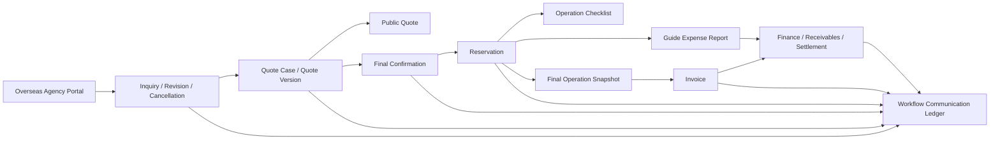

# 정호여행사 JHT Booking System

이 문서는 정호여행사 부킹엔진의 **시스템 아키텍처**와 **사용 설명서**를 한글로 정리한 README입니다.  
GitHub 저장소 첫 화면에서 개발자, 내부 직원, 운영 담당자가 같은 기준으로 시스템 구조와 사용 방법을 확인하는 것을 목적으로 합니다.

정호여행사 인바운드 단체 여행 업무를 하나의 코드 중심으로 관리하기 위한 부킹 엔진입니다.  
해외 파트너 문의, 견적, 확정서, 예약, 공급사 운영, 인보이스, 미수금, 정산, 가이드 실비 지출 보고까지 같은 업무 흐름 안에서 연결하는 것을 목표로 합니다.

가장 중요한 도메인 규칙은 다음 두 대상을 절대 섞지 않는 것입니다.

- `Overseas Agency`: 정호여행사에 견적을 요청하고 단체를 송객하며 대금을 지급하는 해외 파트너사입니다.
- `Domestic Supplier`: 호텔, 차량, 식당, 관광지, 가이드, 기타 원가를 제공하는 국내 공급사입니다.

두 대상은 권한, 회계 흐름, 커뮤니케이션 방식, 노출 데이터가 다르므로 코드와 DB에서도 별도 테이블 패밀리로 관리합니다.

## 현재 구현 범위

- Next.js App Router 기반 내부 관리자와 해외 파트너 포털
- Supabase Postgres, Auth, RLS, Storage를 전제로 한 DB 마이그레이션
- 해외 파트너 가입 신청, 승인, 거절, freezing, mother ID와 서브 계정 관리 구조
- 국가 코드/국가명 공통 관리와 환율 공통 관리
- 국내 공급사 원가 마스터 수동 생성, 이미지 최대 10장 설계, Excel 템플릿/업로드/다운로드
- 엑셀 견적서 방식의 견적 원가표 UI, 카테고리별 원가, 수량, PAX, 환율, 마진, 자동/수동 계산
- 파트너 공개용 견적서, 일정 description, 이미지, 조건, 공개 금액 관리
- 확정 견적서 이후 예약 단체 현황표, 월간 캘린더, 미완료 단체 리스트, 예약 체크리스트
- 최종 확정서, 최종 오퍼레이션 스냅샷, 자동 인보이스 생성 구조
- 인보이스 버전 관리, Excel 다운로드, 수금/미수금/정산 상태 관리
- 가이드 실비 지출결의서, PMB 인센티브 파일 기반 실비 항목, 인보이스와 매출분석 연결
- workflow code 중심의 포털 커뮤니케이션 원장
- 로그인/Supabase 미연결 개발 단계에서 UI 확인이 가능한 preview/demo data 흐름

## 기술 스택

- Framework: Next.js App Router
- UI: React, TypeScript, CSS Modules가 아닌 전역 CSS 기반 운영 UI
- Runtime: Node.js
- Database/Auth/Storage: Supabase
- Verification: Node test runner, TypeScript, custom schema/API/security verification scripts
- Spreadsheet: 자체 XLSX 생성/파싱 유틸리티

## 핵심 설계 원칙

### 1. 하나의 Workflow Code

업무의 모든 단계는 같은 코드를 기준으로 연결합니다.

```text
new inquiry code
= inquiry code
= quotation code
= confirmation code
= reservation code
= invoice code
= finance code
= guide expense report no
```

예시:

```text
Q-2026-TH-001
```

이 코드를 통해 파트너 문의, 재견적 요청, 확정서, 예약 체크리스트, 인보이스, 미수금, 가이드 실비, 포털 메시지 이력을 한 화면에서 추적할 수 있도록 설계했습니다.

### 2. 내부 원가와 파트너 공개 데이터 분리

파트너 포털에는 다음 정보만 노출합니다.

- 공개 견적 금액
- 공개 일정
- 공개 이미지와 description
- 파트너가 보아도 되는 요청/회신 이력
- 공개 인보이스와 결제 요약

다음 정보는 내부 전용입니다.

- 국내 공급사 원가
- 마진율
- 내부 견적 원가표
- 공급사 메시지
- 내부 오퍼레이션 메모
- 회계 정산 내부 기록

### 3. Excel 업무 방식 보존

기존 업무에서 사용하던 견적서, 단체현황표, 인보이스, PMB 지출결의서의 구조를 화면과 데이터 모델에 반영합니다.

- 견적: 호텔, 차량, 식사, 관광지, 가이드, 기타 원가를 표 형태로 관리
- 예약: 구글 캘린더형 단체 bar와 단체현황표 기반 상태 관리
- 인보이스: 최종 견적서와 최종 오퍼레이션 정보를 기반으로 자동 생성
- 가이드 지출: 실제 투어 후 실비 항목을 입력하고 인보이스 대비 매출 분석에 사용

## 전체 아키텍처



### 주요 레이어

```text
src/app
  Next.js 화면과 API route

src/components
  관리자/파트너 공통 UI 컴포넌트

src/features
  도메인별 query, type, demo data, 업무 로직

src/lib
  Supabase client, auth, audit, domain utility, XLSX utility

supabase/migrations
  실제 DB 구조, RLS, 정책, 업무 테이블 정의

tests
  도메인 규칙, API 경계, schema boundary, XLSX, finance, workflow 검증
```

## 주요 모듈 설명

### 내부 관리자 대시보드

경로: `/admin`

파트너 문의, 확정 단체, 취소 단체, 전체 문의, 견적 건수, 총 PAX, 정산 완료, 미수금 단체, 미수금 금액을 한눈에 확인합니다.  
국가별, 파트너별, 기간별, status별로 조회하는 구조이며, KPI 타일은 관련 페이지로 이동하는 네비게이션 역할도 합니다.

### 해외 파트너 관리

경로: `/admin/agencies`

해외 파트너 가입 신청, 승인, 거절, freezing, mother ID, 서브 계정, 강제 탈퇴, 로그인 로그, 이메일 발송 이벤트를 관리합니다.

파트너 가입 신청 화면:

```text
/agency/signup
```

### 국가/환율 공통 관리

경로:

```text
/admin/exchange-rates
/api/countries
/api/exchange-rates
```

국가 코드와 국가명은 공통 마스터로 관리합니다.  
파트너가 입력한 country name은 기본값으로 보존하되, 내부에서는 country code와 매핑하여 환율, 파트너사, 견적서에 연결합니다.

### 국내 공급사 원가 마스터

경로: `/admin/domestic-suppliers`

관리 대상:

- 호텔: 호텔명, 기본정보, 객실 타입, 기간별 객실가, 조식, 연회장, 부대시설, 이미지
- 차량: 공급사, 차량 종류, From/To 지역 가격, 추가 시간 요금
- 식사: 식당, 주소/지역, 메뉴별 가격, 할랄/Non Halal/Vegetarian 태그, 수용 인원, 영업시간, 이미지
- 관광지: 운영시간, 티켓 타입, 성인/아동 가격, 카테고리 태그, 이미지
- 가이드: 쇼핑투어/Non 쇼핑투어 비용, 인하우스/freelancer 태그
- 기타 비용: 짐차, KTX, 항공권 등
- 인센티브 연회장: 수용 인원, 메뉴, 메뉴 가격, 빔프로젝트/LED/PA System 등 체크박스형 부대시설

Excel 기능:

- 템플릿 다운로드
- 전체 업로드
- 전체 다운로드

### 견적 관리

경로: `/admin/quote-cases`

엑셀 견적서 구조를 기준으로 원가표를 관리합니다.

- 호텔, 차량, 식사, 관광지, 가이드, 기타 영역 구분
- day별 quote item과 itinerary day 연결
- 수량, PAX, 원가, 환율, 마진 자동 계산
- 개별 아이템별 환율/마진과 전체 일괄 환율/마진
- 키워드 기반 국내 공급사 아이템 검색
- 공개 견적서용 일정 description, 호텔/메뉴/관광지 이미지 연결
- terms & conditions 포함

파트너 공개 견적:

```text
/agency/quote-cases
/agency/quote-cases/:shareId
```

### 예약 관리

경로: `/admin/reservations`

정호여행사의 단체현황표 업무를 기준으로 다시 설계한 예약 관리 화면입니다.

- 월간 group calendar
- 여행사명 + 단체명으로 보이는 bar
- 호텔 블럭, 호텔 리컨펌/최종확정, 차량예약, 가이드 배정, 기사 정보 누락 시 빨간색 미완료 bar
- 연도/월 선택
- 액션 리스트 20/50/100개 보기
- 미완료 단체 전용 리스트
- 월별, 주별, 연별, 국가별, 파트너별 summary dashboard

미완료 단체:

```text
/admin/reservations/incomplete
```

예약 상세:

```text
/admin/reservations/:reservationId
/admin/reservations/:reservationId/operation-checklist
```

### 최종 확정서

경로: `/admin/confirmations`

최종 견적이 확정된 뒤 파트너에게 전달할 확정서를 관리합니다.

- 리스트 수 필터
- 기간 필터
- 국가별 필터
- 에이전트별 필터
- status summary dashboard
- 가로 리스트형 단체 카드
- 최종 확정서 생성/열기

### 인보이스와 회계

경로:

```text
/admin/finance/invoices
/admin/finance/invoices/:invoiceId
/agency/invoices
/agency/invoices/:invoiceId
```

인보이스는 최종 확정 견적서와 내부 오퍼레이터가 확정한 최종 호텔/일정 정보를 기반으로 생성합니다.

포함 정보:

- day별 호텔명과 룸타입
- day별 일정
- 식사 메뉴
- 관광지
- 특이사항
- 항공 정보
- 은행/결제 정보
- 인보이스 버전
- deposit, 잔금, 수금 완료, 미수금 상태

Excel 다운로드:

```text
/api/finance/invoices/:id/export-xlsx
```

### 가이드 실비 지출결의서

경로:

```text
/admin/guide-expenses
/admin/guide-expenses/:reservationId
```

투어 종료 후 가이드가 실제 사용 비용을 입력하는 화면입니다.  
PMB 인센티브 파일 구조를 참고하여 숙박비, 식음료비, 입장료, 기타 현금, 가이드 비용, 쇼핑 수수료를 관리합니다.

가이드 리포트의 `Report No`는 별도 번호가 아니라 workflow code와 같은 값을 사용합니다.  
따라서 인보이스 최종 금액과 실제 지출을 같은 코드 아래에서 비교할 수 있습니다.

### Workflow Communication Ledger

경로:

```text
/admin/workflows
/admin/workflows/:workflowCode
/agency/workflows
/agency/workflows/:workflowCode
```

이메일에 흩어져 있던 파트너 문의와 회신을 포털 내부에서 관리하기 위한 커뮤니케이션 원장입니다.

가능한 메시지 종류:

- 신규 문의
- 재견적 요청
- 호텔 변경
- 식사 변경
- 차량 변경
- 관광지 변경
- 취소 요청
- 인보이스 질문
- 회계 follow-up
- 오퍼레이션 업데이트

내부 사용자는 메시지를 `partner_visible` 또는 `internal_only`로 저장할 수 있습니다.  
파트너 사용자는 `partner_visible` 메시지만 조회할 수 있습니다.

## Supabase DB 구조 요약

주요 테이블 패밀리:

```text
agency_*
  해외 파트너, 파트너 사용자, 가입 신청, 문의, 포털 요청

domestic_supplier_*
  국내 공급사, 상품, 가격, 원가 마스터

quote_*
  견적 건, 견적 버전, 일정, 원가 아이템, 공개 견적 블록

reservations
  확정 단체, 단체현황표, 룸링, 오퍼레이션 체크리스트

invoices / payments / settlements
  인보이스, 입금, 미수금, 정산

guide_expense_reports / guide_expense_lines
  가이드 실비 지출결의서

workflow_threads / workflow_messages / workflow_action_items
  workflow code 중심 커뮤니케이션 원장

country_references / exchange_rates
  국가 코드, 국가명, 환율 공통 관리
```

RLS 기본 방향:

- 내부 사용자는 역할에 따라 관리 화면 접근
- 해외 파트너는 자기 agency account에 연결된 공개 데이터만 조회
- 국내 공급사 원가, 마진, 내부 메모, 공급사 메시지, 정산 내부 정보는 파트너에게 비노출

## 로컬 개발 방법

권장 로컬 경로:

```text
C:\Users\Issac\Documents\Codex\JHT_Booking_Sys
```

설치:

```bash
npm install
```

개발 서버:

```bash
npm run dev -- -p 3100
```

브라우저:

```text
http://localhost:3100/admin
```

검증:

```bash
npm run test
npm run typecheck
npm run build
```

전체 v1 검증:

```bash
npm run verify:v1
```

개별 검증 스크립트:

```bash
npm run verify:env
npm run verify:schema
npm run verify:api-guards
npm run verify:api-body-order
npm run verify:api-responses
npm run verify:api-contract
npm run verify:repo-safety
npm run verify:security-config
npm run verify:page-smoke
npm run verify:app-route-smoke
```

## 사용 설명서

이 장은 실제 업무자가 시스템을 어떤 순서로 사용하는지 설명합니다.  
현재 개발 단계에서는 Supabase 로그인/권한이 완전히 연결되지 않은 화면도 preview/demo data로 확인할 수 있습니다.

### 역할별 기본 메뉴

#### 내부 관리자

주요 경로:

```text
/admin
/admin/quote-cases
/admin/reservations
/admin/confirmations
/admin/finance/invoices
/admin/finance/settlements
/admin/domestic-suppliers
/admin/exchange-rates
/admin/agencies
/admin/guide-expenses
/admin/workflows
```

내부 관리자는 파트너 가입 승인, 국내 공급사 원가 관리, 견적 작성, 예약 운영, 확정서 작성, 인보이스 발행, 정산, 가이드 실비, 포털 커뮤니케이션을 관리합니다.

#### 해외 파트너

주요 경로:

```text
/agency
/agency/signup
/agency/inquiries
/agency/inquiries/new
/agency/quote-cases
/agency/reservations
/agency/invoices
/agency/workflows
```

해외 파트너는 신규 견적 문의, 재견적 요청, 예약 요청, 취소 문의, 공개 견적 확인, 예약 현황 확인, 인보이스 확인, JHT와의 포털 메시지 송수신을 수행합니다.

#### 회계 담당자

주요 경로:

```text
/admin/finance/invoices
/admin/finance/settlements
/admin/guide-expenses
```

회계 담당자는 발행된 인보이스, 입금 내역, 미수금, 실제 비용, 쇼핑 수수료, 최종 정산 상태를 확인합니다.

#### 오퍼레이션 담당자

주요 경로:

```text
/admin/reservations
/admin/reservations/:reservationId
/admin/reservations/:reservationId/operation-checklist
/admin/confirmations/:reservationId
```

오퍼레이션 담당자는 확정 단체의 호텔 블럭, 호텔 리컨펌, 차량 예약, 가이드 배정, 기사 정보, 룸링 리스트, 최종 일정 내용을 관리합니다.

### 1. 파트너 가입

1. 파트너사가 `/agency/signup`에서 가입 신청
2. 내부 관리자가 `/admin/agencies`에서 신청 확인
3. 승인 또는 거절
4. 승인 시 mother ID와 서브 계정 관리
5. freezing 또는 탈퇴 시 계정 상태 변경과 이메일 발송 이벤트 기록

### 2. 신규 문의

1. 파트너가 `/agency/inquiries/new`에서 신규 견적 문의 생성
2. 필수값: 투어 타이틀, PAX, 기간, 박 수
3. 선택값: 도착일, 출발일, 항공편, 상세 일정 텍스트
4. 시스템이 tour/workflow code 생성
5. 내부 관리자가 견적 건으로 전환

### 3. 견적 작성

1. `/admin/quote-cases`에서 견적 건 열기
2. 공급사 원가를 키워드로 검색
3. 호텔/차량/식사/관광지/가이드/기타 항목 입력
4. 환율과 마진 적용
5. itinerary day와 quote item 동기화
6. 파트너 공개용 견적서 생성
7. 파트너가 재견적, 수정, 취소 요청 가능

### 4. 확정서와 예약 전환

1. 최종 견적 status를 accepted/confirmed 상태로 변경
2. 확정서 페이지에서 최종 일정과 조건 확인
3. 예약으로 전환
4. group calendar와 operation checklist에 노출

### 5. 예약 운영

1. 호텔 블럭
2. 호텔 리컨펌/최종확정
3. 차량 예약
4. 가이드 배정
5. 기사 정보 입력
6. 룸링 리스트 관리
7. 미완료 단체는 빨간 bar와 incomplete list에서 follow-up

### 6. 인보이스

1. 최종 견적과 최종 오퍼레이션 스냅샷 기반 인보이스 자동 생성
2. 필요 시 버전 생성
3. Excel 다운로드
4. 파트너 포털에서 공개 인보이스 확인
5. 회계 담당자가 deposit, 잔금, 수금 완료, 미수금 상태 관리

### 7. 가이드 실비

1. 투어 종료 후 `/admin/guide-expenses/:reservationId`에서 지출결의서 작성
2. 숙박, 식음료, 입장료, 기타 현금, 가이드, 쇼핑 수수료 입력
3. 제출 시 정산/실비 분석 데이터로 연결
4. 인보이스 금액 대비 실제 비용과 수익성 확인

### 8. 포털 커뮤니케이션

1. 모든 문의와 회신은 workflow code 아래 저장
2. 파트너 요청은 action item으로 전환 가능
3. 내부 메모는 `internal_only`로 저장
4. 파트너 공개 답변은 `partner_visible`로 저장
5. 견적, 예약, 인보이스, 정산 단계 전체 history 확인

## 실제 Supabase 연결 전 체크리스트

1. `.env.local`에 Supabase URL과 anon/service role key 설정
2. Supabase migration 적용
3. RLS 정책 확인
4. Storage bucket 생성
5. 이미지 업로드 bucket 정책 확인
6. Notion CSV와 기존 Excel/CSV 데이터 정제
7. 국가/환율 공통 마스터 선등록
8. 국내 공급사 원가 마스터 업로드
9. 해외 파트너 계정 승인 플로우 테스트
10. 내부 관리자, 회계, 오퍼레이션 역할별 접근 테스트
11. 파트너 포털에서 원가/마진이 보이지 않는지 확인
12. `npm run verify:v1` 실행

## 현재 검증 상태

최근 로컬 검증 기준:

```bash
npm run test
npm run typecheck
```

현재 테스트 범위에는 다음이 포함됩니다.

- 해외 파트너와 국내 공급사 경계
- 견적 원가 스냅샷과 마진 계산
- 예약 작업 생성과 오퍼레이션 잠금
- 인보이스 자동 생성
- 가이드 지출결의서 요약과 정산 연결
- workflow communication ledger
- 국가/환율 공통 관리
- agency onboarding governance
- API 에러 응답과 고객 안전 query

## 주의 사항

- 현재 개발 단계에서는 일부 페이지가 로그인 없이 preview/demo data를 보여줍니다. 실제 Supabase 연결 후에는 Auth/RLS 기준으로 접근을 제한해야 합니다.
- 파트너 포털에는 원가, 마진, 내부 공급사 정보가 노출되면 안 됩니다.
- 인보이스, 확정서, 정산, 가이드 실비는 모두 workflow code로 연결해야 합니다.
- Notion/Excel 데이터를 Supabase에 넣기 전에는 국가 코드, 파트너명, 통화, 날짜 형식, 공급사 카테고리를 먼저 정규화해야 합니다.
- 운영 전에는 `npm run verify:v1`과 실제 계정 기반 화면 QA를 반드시 수행해야 합니다.
