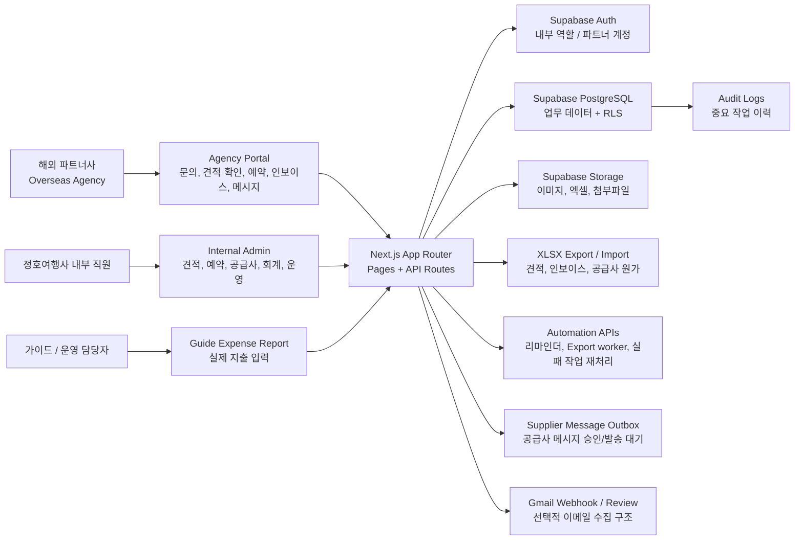
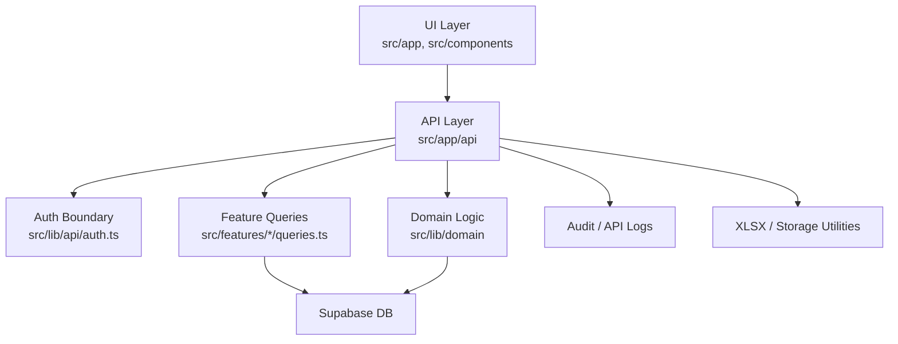
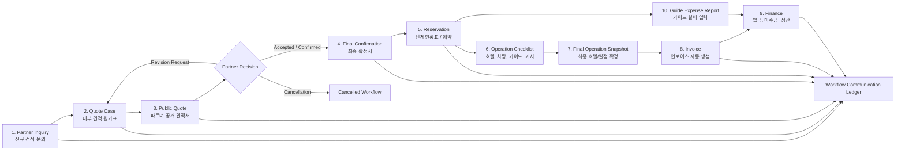
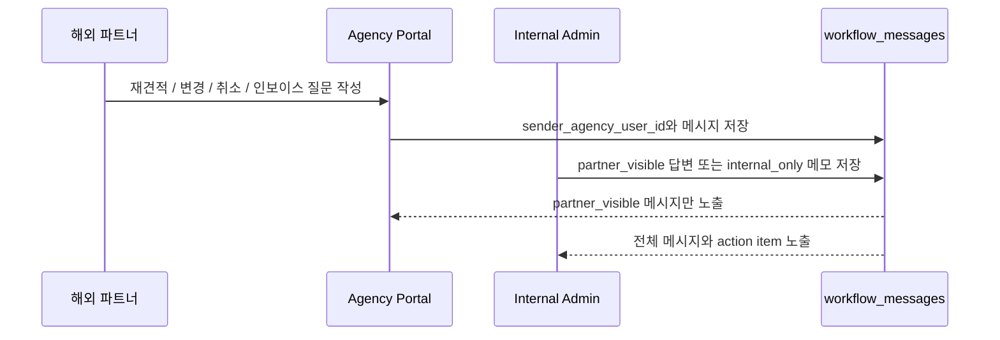
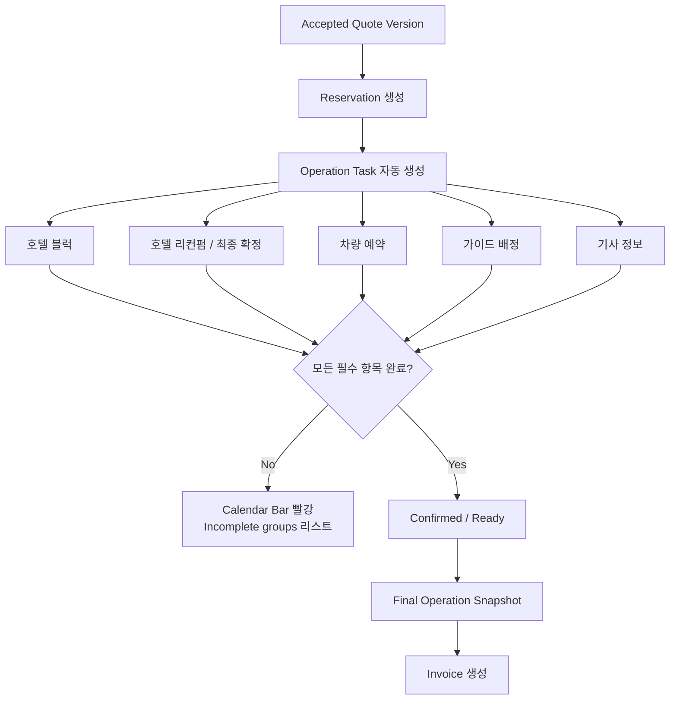
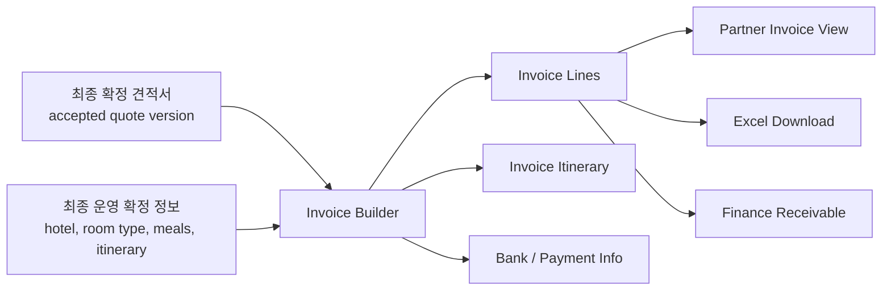
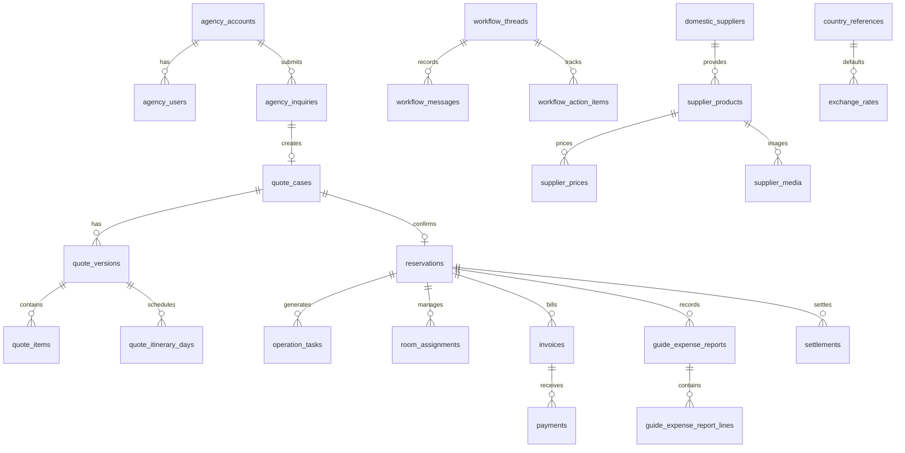
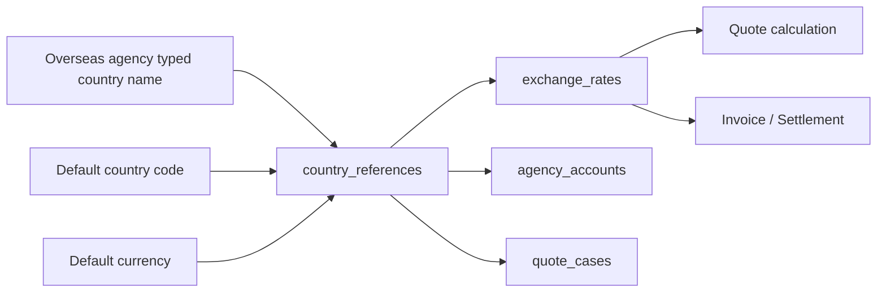
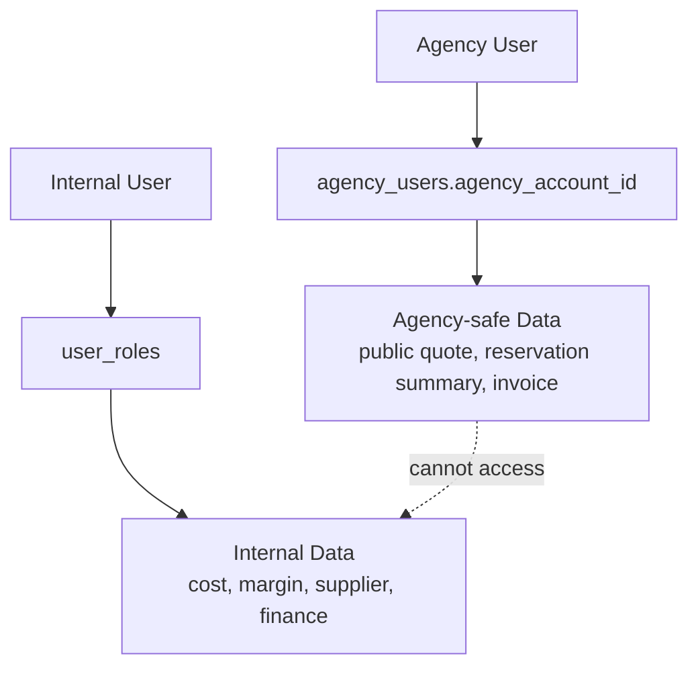
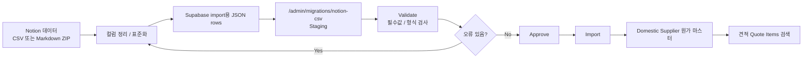

# 정호여행사 JHT Booking System

## 팀 테스트 바로가기

팀원이 외부에서 내부 관리자와 파트너 포털을 테스트해야 할 때는 아래 문서를 먼저 봅니다.

- [팀 테스트 런북: 외부 접속, 테스트 체크리스트, Notion CSV import 절차](docs/team-test-runbook.md)
- [Notion Markdown / CSV Export 변환기](docs/notion-markdown-import.md)

빠른 실행 명령:

```powershell
npm run dev:team
npm run tunnel:cloudflare
```

공유 URL 형식:

```text
내부 관리자: https://<temporary-tunnel-url>/admin
파트너 포털: https://<temporary-tunnel-url>/agency
```

주의: Cloudflare Tunnel URL은 임시 테스트용입니다. 실제 개인정보, 여권 정보, 결제 정보, 운영 비밀번호를 입력하지 않습니다.

정호여행사 인바운드 여행 업무를 하나의 `workflow code`로 연결해 관리하는 Next.js + Supabase 기반 운영 시스템입니다.

이 문서는 GitHub 첫 화면에서 개발자, 내부 운영자, 회계 담당자, 파트너 포털 기획자가 같은 기준으로 시스템을 이해할 수 있도록 작성한 한글 시스템 아키텍처와 사용 설명서입니다.

## 목차

1. 시스템 목표
2. 핵심 업무 원칙
3. 전체 시스템 아키텍처
4. 업무 워크플로우 아키텍처
5. 화면 및 사용자 영역
6. 도메인 모듈 구조
7. 데이터베이스 아키텍처
8. 권한과 보안 경계
9. 주요 업무 사용 흐름
10. 로컬 개발과 검증 방법
11. Supabase 연결 전 체크리스트
12. Notion 데이터 Supabase 이관 방법
13. 개발 원칙

## 1. 시스템 목표

정호여행사의 기존 엑셀, 이메일, 노션, 단체현황표, 인보이스, 가이드 지출결의서 업무를 하나의 운영 시스템으로 통합합니다.

핵심 목표는 다음과 같습니다.

- 해외 파트너사의 신규 견적 문의부터 변경 요청, 취소 요청, 예약, 인보이스, 정산, 가이드 실비까지 하나의 흐름으로 관리합니다.
- 내부 직원은 견적 원가, 공급사 비용, 마진, 예약 진행 상태, 미수금, 실제 지출을 한 화면에서 추적할 수 있습니다.
- 해외 파트너사는 내부 원가와 마진을 보지 못하고, 공개 견적서, 일정, 인보이스, 커뮤니케이션 내역만 확인합니다.
- 모든 업무는 하나의 `workflow code`를 기준으로 연결합니다.
- 기존 엑셀 견적서와 단체현황표 업무 방식을 최대한 유지하되, 자동 계산과 DB 검색, 버전 관리, 상태 추적을 추가합니다.

## 2. 핵심 업무 원칙

### 2.1 하나의 Workflow Code

정호여행사 업무는 견적 코드, 투어 코드, 예약 코드, 인보이스 코드가 따로 흩어지면 추적이 어려워집니다. 이 시스템은 아래 모든 업무를 같은 코드로 묶는 것을 기본 원칙으로 합니다.

```text
new inquiry code
= inquiry code
= quotation code
= confirmation code
= reservation code
= invoice code
= finance code
= guide expense report no
= workflow communication code
```

예시:

```text
Q-2026-TH-001
```

이 코드를 기준으로 다음 데이터를 한 번에 추적합니다.

- 파트너사의 최초 신규 견적 문의
- 파트너사의 재견적, 날짜 변경, 호텔 변경, 식사 변경, 관광지 변경, 취소 요청
- 내부 견적 원가표와 공개 견적서
- 최종 확정서
- 예약 단체 현황표
- 호텔 블럭, 호텔 리컨펌, 차량 예약, 가이드 배정, 기사 정보
- 인보이스와 입금, 미수금, 정산 상태
- 가이드 실제 지출결의서
- 파트너와 내부 직원 간 포털 커뮤니케이션 이력

### 2.2 Overseas Agency와 Domestic Supplier의 엄격한 분리

이 시스템에서 `Overseas Agency`와 `Domestic Supplier`는 절대로 같은 개념으로 합치지 않습니다.

| 구분 | 시스템명 | 의미 | 파트너 포털 노출 여부 |
|---|---|---|---|
| 해외 파트너 여행사 | `Overseas Agency` | 정호여행사에 견적을 요청하고 단체를 송객하는 해외 고객사 | 노출 |
| 국내 공급사 | `Domestic Supplier` | 호텔, 차량, 식당, 관광지, 가이드, 기타 원가 제공자 | 내부 전용 |

해외 파트너는 아래 정보를 볼 수 있습니다.

- 공개 견적서
- 공개 일정표
- 공개 이미지와 설명
- 최종 확정서
- 인보이스
- 예약 진행 요약
- 파트너에게 공개된 커뮤니케이션 메시지

해외 파트너는 아래 정보를 절대 볼 수 없습니다.

- 국내 공급사 원가
- 내부 마진
- 공급사별 실제 비용
- 내부 운영 메모
- 내부 정산과 수익 분석
- 가이드 지출결의서 상세

### 2.3 엑셀 업무 방식의 시스템화

기존 정호여행사 업무에는 여러 엑셀 기반 양식이 존재합니다.

- 견적서 엑셀
- 단체현황표
- 인보이스 엑셀
- 자금일보/미수현황
- 가이드 지출결의서

시스템은 이 엑셀의 사고방식을 다음처럼 DB와 화면으로 변환합니다.

| 기존 엑셀 업무 | 시스템 구조 |
|---|---|
| 셀별 원가 입력 | `quote_items`와 공급사 원가 snapshot |
| 수량, PAX, 환율, 마진 계산식 | 자동 계산 preset과 수동 override |
| 호텔/차량/식사/관광지/기타 영역 구분 | Quote Items 카테고리 영역 |
| 일정표 day별 입력 | `quote_itinerary_days`, final operation snapshot |
| 단체현황표 | Reservation group calendar와 dashboard |
| 인보이스 버전 | `invoices`, `invoice_versions`, invoice line items |
| 미수금 관리 | finance receivable/settlement 상태 |
| 가이드 실비 입력 | guide expense report와 finance expense 연결 |

## 3. 전체 시스템 아키텍처

### 3.1 시스템 컨텍스트



### 3.2 애플리케이션 계층



계층별 책임:

| 계층 | 주요 위치 | 책임 |
|---|---|---|
| 화면 라우트 | `src/app/admin`, `src/app/agency` | 내부 관리자와 파트너 포털 화면 |
| API 라우트 | `src/app/api` | 인증, 권한, 입력 검증, DB 변경, 감사 로그 |
| 공통 컴포넌트 | `src/components` | 폼, 문서, 대시보드, 네비게이션, 다크모드 |
| 도메인 조회 | `src/features` | 화면별 데이터 조회, 타입 변환, 데모 데이터 |
| 순수 업무 로직 | `src/lib/domain` | 계산, 상태 전환, 자동 생성 규칙 |
| Supabase | `supabase/migrations`, `supabase/seed.sql` | 실제 DB 구조, RLS, seed 데이터 |
| 검증 | `tests`, `scripts` | 업무 규칙, schema boundary, route smoke 검증 |

## 4. 업무 워크플로우 아키텍처

### 4.1 문의부터 정산까지의 흐름



### 4.2 파트너 커뮤니케이션 원장

이메일처럼 흩어진 대화를 포털 안에서 `workflow code`별 원장으로 관리합니다.



메시지 작성자 연결 방식:

| 작성자 | 저장 ID | 표시 정보 |
|---|---|---|
| 내부 직원 | `sender_profile_id` | `profiles.display_name`, `profiles.email` |
| 해외 파트너 사용자 | `sender_agency_user_id` | `agency_users.name`, `agency_users.email` |
| 시스템 자동 메시지 | 별도 ID 없음 | `system` |

### 4.3 예약 운영 체크리스트 흐름



### 4.4 인보이스 자동 생성 흐름



## 5. 화면 및 사용자 영역

### 5.1 상단 메뉴 구조

현재 상단 네비게이션은 핵심 메뉴를 우선 노출하고, 부가 기능은 `More` 안에 둡니다.

```text
Logo | Dashboard | Quotes | Reservations | Finance | More ▾ | Log in / Log out | EN/KOR | Dark
```

`More` 메뉴:

- 국내 공급사
- 환율 관리
- Workflows
- Confirmations
- Guide Expenses
- 해외 파트너 포털
- Users
- Audit

### 5.2 내부 관리자 영역

주요 경로:

```text
/admin
/admin/quote-cases
/admin/reservations
/admin/reservations/incomplete
/admin/confirmations
/admin/finance/invoices
/admin/finance/settlements
/admin/domestic-suppliers
/admin/exchange-rates
/admin/agencies
/admin/guide-expenses
/admin/workflows
/admin/audit
```

주요 기능:

- 전체 대시보드
- 파트너 문의, 확정, 취소, 미수금, 정산 상태 조회
- 견적 원가표 작성
- 공급사 원가 DB 관리
- 예약 단체 달력 및 incomplete follow-up
- 최종 확정서 작성
- 인보이스 작성과 엑셀 다운로드
- 가이드 실제 지출 입력
- 파트너 커뮤니케이션 원장
- 감사 로그와 API 로그 확인

### 5.3 해외 파트너 포털

주요 경로:

```text
/agency
/agency/signup
/agency/inquiries
/agency/inquiries/new
/agency/quote-cases
/agency/reservations
/agency/invoices
/agency/workflows
```

주요 기능:

- 파트너 가입 신청
- 신규 견적 문의
- 견적 변경 요청
- 취소 문의
- 공개 견적서 확인
- 예약 리스트 확인
- 인보이스 확인
- 하나의 workflow code 기준으로 메시지와 회신 확인

### 5.4 회계 담당 영역

주요 경로:

```text
/admin/finance/invoices
/admin/finance/settlements
/admin/guide-expenses
```

주요 기능:

- 최종 인보이스 확인
- Deposit, 잔금, 미수금 상태 관리
- 자금일보/미수현황과 연결되는 receivable 상태 관리
- 가이드 실비와 인보이스 매출 비교
- 실제 수익 분석

### 5.5 운영 담당 영역

주요 경로:

```text
/admin/reservations
/admin/reservations/:reservationId
/admin/reservations/:reservationId/operation-checklist
/admin/confirmations/:reservationId
```

주요 기능:

- 월별 group calendar
- 단체별 예약 상태 bar
- 미완료 단체 리스트
- 호텔 블럭과 최종 리컨펌
- 차량 예약과 기사 정보
- 가이드 배정
- 최종 운영 일정 확정

## 6. 도메인 모듈 구조

| 모듈 | 책임 | 주요 화면/API | 주요 DB |
|---|---|---|---|
| Agency | 해외 파트너 회사, 사용자, 가입 신청, 문의 | `/admin/agencies`, `/agency/signup`, `/api/agency/*` | `agency_accounts`, `agency_users`, `agency_signup_applications`, `agency_inquiries` |
| Domestic Supplier | 국내 공급사와 원가 마스터 | `/admin/domestic-suppliers`, `/api/domestic-suppliers/*` | `domestic_suppliers`, `supplier_products`, `supplier_prices`, `supplier_media` |
| Countries / FX | 국가 코드, 국가명, 기본 통화, 환율 | `/admin/exchange-rates`, `/api/countries`, `/api/exchange-rates` | `country_references`, `exchange_rates` |
| Quotation | 견적 케이스, 버전, 원가표, 공개 견적 | `/admin/quote-cases`, `/agency/quote-cases` | `quote_cases`, `quote_versions`, `quote_items`, `quote_itinerary_days` |
| Reservation | 확정 단체 관리, 단체현황표, 달력 | `/admin/reservations`, `/agency/reservations` | `reservations`, `reservation_status_history`, `room_assignments` |
| Operations | 예약 후 운영 체크리스트와 task | `/admin/operations/tasks`, operation checklist | `operation_tasks`, `operation_reminder_logs` |
| Confirmations | 최종 확정서 | `/admin/confirmations` | `final_operation_snapshots`, reservation 연결 데이터 |
| Finance | 인보이스, 입금, 미수금, 정산 | `/admin/finance/*`, `/agency/invoices` | `invoices`, `invoice_lines`, `payments`, `settlements` |
| Guide Expenses | 가이드 실제 지출결의서 | `/admin/guide-expenses` | `guide_expense_reports`, `guide_expense_report_lines`, `expenses` |
| Workflow | 포털 커뮤니케이션 원장 | `/admin/workflows`, `/agency/workflows` | `workflow_threads`, `workflow_messages`, `workflow_action_items` |
| Automation | 엑셀 export, 리마인더, Gmail review, 실패 작업 | `/admin/automation/*`, `/api/automation/*` | `quote_exports`, `email_threads`, `api_logs` |
| Audit | 중요 변경 이력 | `/admin/audit` | `audit_logs`, `api_logs` |

## 7. 데이터베이스 아키텍처

### 7.1 도메인별 DB 맵



### 7.2 핵심 테이블 설명

#### Agency 계열

| 테이블 | 목적 |
|---|---|
| `agency_accounts` | 해외 파트너 회사 |
| `agency_users` | 파트너 포털 사용자, mother ID와 sub account 구조 |
| `agency_signup_applications` | 파트너 가입 신청 |
| `agency_contacts` | 파트너 회사 연락처 |
| `agency_inquiries` | 신규 문의, 재견적, 변경, 취소 요청 |
| `agency_login_events` | 파트너 로그인 기록 |
| `agency_account_email_events` | 가입 승인, freezing 등 이메일 이벤트 |
| `account_recovery_requests` | 이메일 찾기와 비밀번호 재설정 요청 이력 및 관리자 처리 상태 |

#### Domestic Supplier 계열

| 테이블 | 목적 |
|---|---|
| `domestic_suppliers` | 호텔, 차량, 식당, 관광지, 가이드, 기타 공급사 |
| `supplier_contacts` | 공급사 담당자 |
| `supplier_products` | 객실, 차량 타입, 메뉴, 입장권, 가이드 서비스 |
| `supplier_prices` | 기간, 요일, 인원 조건별 원가 |
| `supplier_media` | 공급사 및 상품 이미지, 최대 10장 정책 |

#### Quote 계열

| 테이블 | 목적 |
|---|---|
| `quote_cases` | 견적 건 |
| `quote_versions` | 견적 버전 |
| `quote_items` | 원가표 항목과 snapshot |
| `quote_itinerary_days` | day별 일정 |
| `quote_presentation_blocks` | 파트너용 이미지, 설명, 조건 |
| `route_segments` | 일정 이동 구간 |
| `quote_exports` | 엑셀 export queue |

#### Reservation / Operation 계열

| 테이블 | 목적 |
|---|---|
| `reservations` | 확정 단체 |
| `reservation_status_history` | 예약 상태 변경 이력 |
| `operation_tasks` | 호텔, 차량, 가이드 등 운영 task |
| `rooming_lists` | 파트너 업로드 룸리스트 |
| `passengers` | 승객 정보 |
| `room_assignments` | 객실 배정 |
| `supplier_message_outbox` | 공급사 메시지 draft, approval, send queue |

#### Finance 계열

| 테이블 | 목적 |
|---|---|
| `invoices` | 인보이스 헤더와 상태 |
| `invoice_lines` | 인보이스 항목 |
| `payments` | 입금 기록 |
| `expenses` | 실제 비용 |
| `extra_revenues` | 추가 매출 |
| `shopping_commissions` | 쇼핑/면세 수수료 |
| `settlements` | 정산 결과 |
| `agency_receivable_ledger` | 해외 에이전시 미수금 ledger |

#### Workflow Communication 계열

| 테이블 | 목적 |
|---|---|
| `workflow_threads` | workflow code별 커뮤니케이션 원장 |
| `workflow_messages` | 파트너와 내부 직원 메시지 |
| `workflow_action_items` | 메시지에서 파생된 follow-up 업무 |

작성자 연결:

- 내부 직원: `workflow_messages.sender_profile_id -> profiles.id`
- 파트너 사용자: `workflow_messages.sender_agency_user_id -> agency_users.id`

### 7.3 국가와 환율 공통 관리

국가명과 국가 코드는 환율과 파트너 입력 데이터를 연결하는 공통 마스터입니다.



핵심 원칙:

- 파트너가 입력한 국가명은 원본값으로 보존합니다.
- 내부에서는 `country_code`, `country_name`, `default_currency`로 표준화합니다.
- 견적, 인보이스, 정산의 환율은 공통 환율 관리 기준을 사용합니다.
- 견적별로 국가별 환율을 추가하고 선택할 수 있어야 합니다.

## 8. 권한과 보안 경계

### 8.1 사용자 역할

| 역할 | 설명 | 접근 가능 영역 |
|---|---|---|
| Admin | 전체 관리자 | 모든 내부 화면 |
| Sales | 견적과 파트너 문의 담당 | Agency, Quote, Workflow |
| Operations | 예약과 행사 운영 담당 | Reservation, Operation, Confirmation |
| Hotel Booking | 호텔 예약 담당 | Hotel 관련 task, supplier message |
| Vehicle Booking | 차량 예약 담당 | Vehicle 관련 task |
| Guide Assignment | 가이드 배정 담당 | Guide 관련 task |
| Content Booking | 식사, 관광지, 콘텐츠 예약 담당 | Meal, Attraction task |
| Finance | 인보이스, 입금, 정산 담당 | Finance, settlement, guide expense |
| Agency User | 해외 파트너 사용자 | 자기 회사의 공개 데이터 |

### 8.2 접근 경계



보안 원칙:

- 모든 비즈니스 테이블은 Supabase RLS 적용을 전제로 합니다.
- 내부 사용자는 역할 기반으로 접근합니다.
- 파트너 사용자는 자기 `agency_account_id`에 연결된 데이터만 조회합니다.
- 공급사 원가와 마진은 파트너 포털 API에서 조회하지 않습니다.
- finance 데이터는 `admin` 또는 `finance` 역할 중심으로 제한합니다.
- high-risk action은 audit log를 남깁니다.

### 8.3 Preview / Demo Mode

현재 개발 및 테스트 단계에서는 일부 페이지가 로그인 없이 preview/demo data를 보여줄 수 있습니다.

목적:

- Supabase 계정 세팅 전에도 UI 확인 가능
- 실제 워크플로우 화면 구조 확인
- 사용자 피드백을 빠르게 반영

운영 전 전환 필요 사항:

- preview data를 실제 Supabase 데이터 조회로 교체
- 로그인과 RLS 경계 완전 적용
- 데모 seed와 테스트용 ID 제거 또는 운영용 seed로 분리

## 9. 주요 업무 사용 흐름

### 9.1 파트너 가입 신청

1. 파트너가 `/agency/signup`에서 가입 신청
2. 회사명, 연락처, 이메일, 국가 선택 입력
3. 내부 관리자가 `/admin/agencies`에서 신청 확인
4. 승인 또는 거절 처리
5. 승인 시 agency account와 mother ID 생성
6. mother ID는 sub account 생성, 비밀번호 변경, freezing, 강제 탈퇴 관리
7. 상태 변경 이벤트는 이메일 이벤트 로그로 기록

### 9.2 신규 견적 문의

1. 파트너가 `/agency/inquiries/new`에서 신규 문의 작성
2. 필수값:
   - 투어 타이틀
   - PAX
   - 기간 또는 도착/출발일
   - 박 수
3. 선택값:
   - 항공편명
   - 일정 텍스트
   - 호텔 등급
   - 식사, 관광지, 특이사항
4. 시스템이 tour/workflow code 생성
5. 내부 관리자가 quote case로 전환

### 9.3 견적 작성

1. 내부 직원이 `/admin/quote-cases`에서 견적 건 열기
2. 호텔, 차량, 식사, 관광지, 가이드, 기타 카테고리별 원가 입력
3. 공급사 마스터에서 키워드로 아이템 검색
4. 수량, PAX, 환율, 마진 자동 계산
5. 필요 시 수동 금액 override
6. day별 itinerary와 quote item 연결
7. 파트너 공개 견적서 생성
8. 파트너가 확인 후 accepted, revision request, cancellation request 중 선택

### 9.4 최종 확정서

1. 파트너가 견적을 accepted/confirmed 처리
2. 내부 직원이 `/admin/confirmations`에서 최종 확정서 작성
3. 최종 호텔명, 룸타입, 일정, 메뉴, 특이사항을 확정
4. 최종 확정서는 reservation과 invoice 자동 생성의 기준 데이터가 됨

### 9.5 예약 관리

1. 확정 견적에서 reservation 생성
2. `/admin/reservations`에서 group calendar 확인
3. 각 단체는 여행사명 + 단체명 bar로 표시
4. 필수 예약 항목이 빠지면 빨간색 incomplete bar로 표시
5. incomplete groups를 클릭하면 리스트형 follow-up 페이지로 이동
6. 각 단체 상세에서 호텔, 차량, 가이드, 기사, 룸리스트 관리

### 9.6 인보이스

1. 최종 견적서와 final operation snapshot 기반으로 인보이스 자동 생성
2. 호텔, 일정, 식사, 관광지, 특이사항을 인보이스에 포함
3. 파트너에게 공개되는 인보이스 화면 제공
4. 내부에서는 인보이스 버전과 payment 상태 관리
5. Excel 다운로드 지원
6. Deposit, 잔금, 미수금, 수금 완료 상태를 finance dashboard와 연결

### 9.7 가이드 지출결의서

1. 투어 종료 후 가이드 또는 내부 담당자가 `/admin/guide-expenses/:reservationId` 작성
2. 숙박비, 식음료비, 입장료, 기타 현금, 가이드 비용, 쇼핑 수수료 입력
3. report no는 workflow code와 동일하게 관리
4. 제출된 지출 라인은 finance expenses로 연결
5. 인보이스 매출과 실제 비용을 비교해 수익 분석

### 9.8 파트너 커뮤니케이션

1. `/admin/workflows/:workflowCode` 또는 `/agency/workflows/:workflowCode`에서 메시지 확인
2. 파트너는 변경 요청, 취소 요청, 인보이스 질문을 작성
3. 내부 직원은 partner visible 답변 또는 internal only 메모 작성
4. 메시지에서 action item 생성 가능
5. 작성자 이름, 이메일, 실제 profile/agency user ID가 연결됨

### 9.9 계정 이메일 및 비밀번호 복구

1. 관리자와 파트너 로그인 화면에서 `Forgot email?` 또는 `Forgot password?`를 선택합니다.
2. 비밀번호 찾기는 등록 이메일로 Supabase Auth의 일회성 복구 링크를 전송합니다.
3. 내부 직원 복구 링크는 `/auth/reset-password`, 해외 파트너 복구 링크는 `/agency/reset-password`에서 열립니다. 새 비밀번호는 12자 이상이고 영문 대문자·소문자·숫자·특수문자를 모두 포함해야 합니다.
4. 이메일 찾기는 회사명, 담당자명, 등록 전화번호가 모두 일치하는 파트너 계정만 마스킹된 이메일을 표시합니다.
5. 자동 확인에 실패한 요청과 내부 직원 요청은 `account_recovery_requests` 원장에 기록됩니다.
6. 관리자만 `/admin/account-recovery`에서 미처리 요청을 조회하고 `Resolve` 또는 `Dismiss`로 처리할 수 있습니다.
7. 공개 복구 API는 IP 원문 대신 해시 fingerprint를 저장하고 시간당 호출 횟수를 제한합니다.
8. Supabase Auth의 Site URL과 Redirect URL에는 실제 운영 도메인 및 `/auth/reset-password`, `/agency/reset-password` 경로가 모두 등록되어 있어야 합니다.

### 9.10 로그인 유지와 원래 작업 화면 복귀

1. 내부 관리자와 파트너 사용자가 로그인하면 Supabase access token과 refresh token이 각각 별도의 HttpOnly 쿠키에 저장됩니다.
2. access token이 만료되기 직전이면 미들웨어가 refresh token으로 세션을 자동 갱신하므로, 정상 로그인 상태에서 메뉴나 액션 버튼을 클릭할 때 로그인 화면이 반복 노출되지 않습니다.
3. 로그인하지 않은 사용자가 보호 화면을 열면 로그인 후 최초로 클릭했던 같은 포털의 화면으로 자동 복귀합니다.
4. 내부 관리자 계정은 `/admin/...`, 파트너 계정은 `/agency/...` 경로 안에서만 복귀할 수 있으며 외부 URL과 다른 포털로의 리디렉션은 차단됩니다.
5. 파트너 포털 소개 화면 `/agency`는 공개되지만 견적, 예약, 문의, 커뮤니케이션 데이터는 로그인한 파트너에게만 노출됩니다.
6. 세션 구조 업데이트 전에 로그인한 브라우저에는 refresh token 쿠키가 없으므로 한 번 로그아웃한 뒤 다시 로그인해야 자동 갱신이 활성화됩니다.

## 10. 로컬 개발과 검증 방법

### 10.1 저장소 위치

권장 로컬 경로:

```text
C:\Users\Issac\Documents\Codex\JHT_Booking_Sys
```

GitHub:

```text
https://github.com/sksmsrkk-glitch/JHT_Booking_Sys
```

### 10.2 설치

```bash
npm install
```

### 10.3 개발 서버 실행

```bash
npm run dev -- -p 3100
```

브라우저:

```text
http://localhost:3100/admin
```

### 10.4 기본 검증

```bash
npm run test
npm run typecheck
```

필요 시:

```bash
npm run build
```

주의:

- `npm run build`는 `.next`를 재생성하므로, 개발 서버가 켜져 있을 때 실행하면 브라우저가 잠시 깨진 CSS나 오래된 chunk를 볼 수 있습니다.
- 빌드가 필요하면 개발 서버를 멈춘 뒤 build를 실행하고 다시 dev server를 시작하는 방식이 안전합니다.

### 10.5 전체 검증 스크립트

```bash
npm run verify:v1
```

개별 검증:

```bash
npm run verify:env
npm run verify:schema
npm run verify:api-guards
npm run verify:api-body-order
npm run verify:api-responses
npm run verify:api-contract
npm run verify:repo-safety
npm run verify:security-config
npm run verify:page-smoke
npm run verify:app-route-smoke
```

## 11. Supabase 연결 전 체크리스트

1. `.env.local`에 Supabase URL과 anon key 설정
2. service role key는 서버 전용으로만 사용
3. Supabase migration 전체 적용
4. RLS policy 적용 확인
5. Storage bucket 생성
6. 이미지 업로드 권한 정책 확인
7. country reference와 exchange rate 기본값 등록
8. Notion CSV와 기존 Excel 데이터를 import 가능한 형태로 정제
9. Domestic Supplier 원가 마스터 업로드
10. 해외 파트너 계정 승인 프로세스 테스트
11. 내부 관리자 role 테스트
12. 파트너 포털에서 원가와 마진이 노출되지 않는지 확인
13. 인보이스, payment, settlement 권한 확인
14. workflow message 작성자 ID 연결 확인
15. `npm run verify:v1` 실행

## 12. Notion 데이터 Supabase 이관 방법

이 절차는 Notion에 있는 관광지, 차량, 식당, 호텔, 가이드, 기타 원가 데이터를 Supabase DB로 옮길 때 사용하는 운영 기준입니다. 핵심 원칙은 **원본 데이터를 바로 운영 테이블에 넣지 않고, 먼저 변환 → staging → validation → approval → import** 단계를 거치는 것입니다.

### 12.1 전체 이관 흐름



### 12.2 Notion에서 데이터를 추출하는 방법

1. Notion에서 이관할 데이터베이스를 엽니다.
2. 우측 상단 `...` 메뉴를 누릅니다.
3. `Export`를 선택합니다.
4. 가능하면 `CSV` 형식으로 export합니다.
5. 이미지, 상세 설명, 페이지 본문, 첨부파일까지 같이 내려받아야 하는 경우에는 `Markdown & CSV` 또는 `Markdown ZIP` export를 사용합니다.
6. 다운로드한 파일은 원본 보존용 폴더에 그대로 보관합니다.

권장 파일명:

```text
notion-attractions-2026-07-05.csv
notion-restaurants-2026-07-05.csv
notion-vehicles-2026-07-05.csv
notion-hotels-2026-07-05.csv
```

### 12.3 이관 대상 테이블과 순서

Domestic Supplier 원가 마스터는 부모-자식 관계가 있으므로 순서가 중요합니다.

| 순서 | 대상 테이블 | 의미 | 먼저 필요한 값 |
|---:|---|---|---|
| 1 | `domestic_suppliers` | 공급사/장소/식당/차량사/호텔 기본 정보 | `company_id` |
| 2 | `supplier_contacts` | 공급사 담당자 연락처 | `domestic_supplier_id` |
| 3 | `supplier_products` | 객실, 차량 타입, 메뉴, 입장권, 가이드 서비스 | `domestic_supplier_id` |
| 4 | `supplier_prices` | 상품별 가격, 기간, 통화, 과금 단위 | `supplier_product_id` |
| 5 | `supplier_media` | 이미지/영상 Storage 경로 또는 URL | supplier 또는 product 연결 기준 |

실무에서는 보통 아래 순서로 나눠서 import합니다.

1. 관광지/식당/차량사/호텔을 `domestic_suppliers`로 먼저 넣습니다.
2. Supabase에서 생성된 `domestic_suppliers.id`를 확인합니다.
3. 메뉴, 입장권, 차량 타입, 객실 타입을 `supplier_products`에 넣습니다.
4. Supabase에서 생성된 `supplier_products.id`를 확인합니다.
5. 실제 가격표를 `supplier_prices`에 넣습니다.
6. 이미지가 있으면 Supabase Storage에 먼저 올리고, 경로를 `supplier_media`에 넣습니다.

### 12.4 필수 컬럼

현재 migration validation 기준 필수값은 다음과 같습니다.

| 테이블 | 필수값 |
|---|---|
| `domestic_suppliers` | `company_id`, `category`, `name_ko` |
| `supplier_contacts` | `domestic_supplier_id`, `name` |
| `supplier_products` | `domestic_supplier_id`, `product_type`, `name_ko`, `search_name` |
| `supplier_prices` | `supplier_product_id`, `pricing_unit`, `currency`, `cost_amount` |
| `supplier_media` | `media_type`, `storage_path` |

Notion 컬럼명은 자유롭게 내려올 수 있지만, Supabase에 넣을 때는 위 필드명으로 변환되어야 합니다.

### 12.5 카테고리 표준값

Notion의 카테고리명은 시스템 표준값으로 맞춰야 합니다.

| Notion 예시 | 시스템 표준값 |
|---|---|
| 호텔, Hotel | `hotel` |
| 차량, 버스, Coach, Van | `vehicle` |
| 식당, 식사, Restaurant, Meal | `restaurant` |
| 관광지, Attraction, Ticket | `attraction` |
| 가이드, Guide | `guide` |
| 기타, KTX, 짐차, 항공권 | `other` |
| 인센티브 연회장 | `incentive_banquet` |

### 12.6 CSV를 import용 JSON rows로 정리하는 방법

현재 `/admin/migrations/notion-csv` 화면은 raw CSV 파일을 직접 업로드하는 화면이 아니라, **CSV를 정리한 JSON rows**를 staging하는 화면입니다.

예를 들어 Notion 관광지 CSV 한 줄이 아래와 같다면:

| 관광지명 | 지역 | 주소 | 운영시간 | 입장료 | 태그 |
|---|---|---|---|---:|---|
| 경복궁 | 서울 | 서울 종로구 사직로 161 | 09:00-18:00 | 3000 | 역사,궁궐 |

먼저 `domestic_suppliers`용 JSON으로 변환합니다.

```json
[
  {
    "company_id": "JHT_COMPANY_UUID",
    "category": "attraction",
    "name_ko": "경복궁",
    "name_en": "Gyeongbokgung Palace",
    "region_level1": "서울",
    "region_level2": "종로",
    "address": "서울 종로구 사직로 161",
    "status": "active",
    "metadata": {
      "operationHours": "09:00-18:00",
      "tags": ["역사", "궁궐"]
    }
  }
]
```

그 다음 입장권은 `supplier_products`와 `supplier_prices`로 나눕니다.

```json
[
  {
    "domestic_supplier_id": "SUPPLIER_UUID",
    "product_type": "ticket",
    "name_ko": "성인 입장권",
    "search_name": "경복궁 성인 입장권 palace adult ticket",
    "status": "active",
    "metadata": {
      "ageType": "adult"
    }
  }
]
```

```json
[
  {
    "supplier_product_id": "PRODUCT_UUID",
    "pricing_unit": "per_person",
    "currency": "KRW",
    "cost_amount": 3000,
    "status": "active",
    "metadata": {
      "source": "notion-attractions-2026-07-05"
    }
  }
]
```

식당은 메뉴별 가격이 다르므로 `supplier_products`에는 메뉴를, `supplier_prices`에는 메뉴별 가격을 넣습니다.

```json
[
  {
    "domestic_supplier_id": "RESTAURANT_SUPPLIER_UUID",
    "product_type": "menu",
    "name_ko": "불고기 정식",
    "search_name": "불고기 정식 bulgogi set halal non halal",
    "status": "active",
    "metadata": {
      "dietaryTags": ["non_halal"],
      "capacity": 80
    }
  }
]
```

차량은 차량 타입 또는 구간을 상품으로 만들고, 구간별 가격을 가격 row로 넣습니다.

```json
[
  {
    "domestic_supplier_id": "VEHICLE_SUPPLIER_UUID",
    "product_type": "vehicle",
    "name_ko": "45인승 대형버스 서울-인천공항",
    "search_name": "45인승 버스 서울 인천공항 coach ICN Seoul",
    "status": "active",
    "metadata": {
      "vehicleType": "45_seater_coach",
      "from": "ICN",
      "to": "Seoul"
    }
  }
]
```

### 12.7 관리자 화면에서 staging하는 방법

1. 개발 서버를 실행합니다.

```bash
npm run dev
```

2. 브라우저에서 아래 화면으로 이동합니다.

```text
http://localhost:3100/admin/migrations/notion-csv
```

3. `Source Name`에 원본 파일명을 입력합니다.

```text
notion-attractions-2026-07-05
```

4. `Target Table`에서 넣을 테이블을 선택합니다.

```text
domestic_suppliers
supplier_products
supplier_prices
supplier_media
```

5. `Rows JSON`에 변환한 JSON array를 붙여넣습니다.
6. `Stage Rows`를 클릭합니다.
7. 생성된 batch에서 `Validate`를 실행합니다.
8. 오류가 있으면 Notion 원본 또는 JSON을 수정한 뒤 다시 staging합니다.
9. 오류가 없으면 `Approve`합니다.
10. 최종 확인 후 `Import`합니다.

주의:

- 한 batch에는 하나의 target table만 넣습니다.
- `domestic_suppliers`를 import한 뒤 생성된 UUID를 확인하고, 그 UUID로 `supplier_products`를 만들어야 합니다.
- `supplier_products`를 import한 뒤 생성된 UUID를 확인하고, 그 UUID로 `supplier_prices`를 만들어야 합니다.
- 운영 DB에 import하기 전에는 반드시 소량 샘플 3~5개로 먼저 테스트합니다.

### 12.8 Markdown ZIP export를 변환하는 방법

Notion에서 이미지와 본문이 포함된 ZIP으로 내려받은 경우에는 변환 스크립트를 사용합니다.

```bash
npm run convert:notion-md -- "C:\Users\Issac\Downloads\notion-export.zip" --out tmp/notion-md-import --company-id "JHT_COMPANY_UUID"
```

출력 파일:

| 파일 | 용도 |
|---|---|
| `notion-md-supabase-import-plan.json` | 전체 변환 결과 |
| `staging-domestic-suppliers.json` | `/admin/migrations/notion-csv`에 넣을 공급사 rows |
| `supplier-products-relationship-rows.json` | 공급사 UUID 매핑 후 넣을 상품 rows |
| `supplier-prices-relationship-rows.json` | 상품 UUID 매핑 후 넣을 가격 rows |
| `supplier-media-relationship-rows.json` | Storage 업로드 후 넣을 media rows |
| `manifest.json` | 변환 요약과 경고 |

세부 문서는 [Notion Markdown Export 변환기](docs/notion-markdown-import.md)를 참고합니다.

### 12.9 이미지와 파일 처리

이미지는 DB row만 만든다고 끝나지 않습니다.

1. 이미지 파일을 Supabase Storage bucket에 업로드합니다.
2. 업로드된 path 또는 public/signed URL을 확인합니다.
3. `supplier_media.storage_path`에 Storage path를 넣습니다.
4. 외부 URL만 있는 경우에는 `image_url` 또는 `metadata.sourceUrl`에 보존합니다.
5. 한 상품 또는 공급사 item당 이미지는 최대 10장만 연결합니다.

권장 Storage path:

```text
supplier-media/attraction/gyeongbokgung/01-main.jpg
supplier-media/restaurant/sample-restaurant/01-menu.jpg
supplier-media/vehicle/coach-company/01-coach.jpg
```

### 12.10 import 전 검수 체크리스트

1. `company_id`가 실제 JHT company UUID인지 확인합니다.
2. `category`가 표준값인지 확인합니다.
3. `name_ko`가 비어 있지 않은지 확인합니다.
4. 검색에 필요한 키워드가 `search_name` 또는 `search_keywords`에 들어갔는지 확인합니다.
5. 통화는 `KRW`, `USD`, `MYR`, `SGD`처럼 대문자 ISO 코드로 맞춥니다.
6. 가격은 콤마 없는 숫자로 정리합니다.
7. 운영시간, 수용인원, dietary tag, halal 여부 등은 `metadata`에 보존합니다.
8. 중복 공급사가 있는지 확인합니다.
9. 같은 식당의 여러 메뉴는 supplier를 중복 생성하지 말고 product로 분리합니다.
10. 같은 관광지의 성인/아동 티켓은 supplier를 중복 생성하지 말고 ticket product와 price로 분리합니다.
11. 차량은 공급사, 차량 타입, 구간, 추가 시간 요금을 분리합니다.
12. 이미지가 실제 Storage에 업로드되어 있는지 확인합니다.
13. `/admin/migrations/notion-csv`에서 validation error가 0인지 확인합니다.
14. import 후 `/admin/domestic-suppliers`에서 키워드 검색이 되는지 확인합니다.
15. 견적 화면 Quote Items에서 해당 아이템이 검색되는지 확인합니다.

### 12.11 Supabase CLI와 DB 검증

Supabase CLI는 프로젝트 dev dependency로 설치되어 있으므로 다음처럼 실행합니다.

```bash
npx supabase --version
```

호스팅 Supabase와 연결한 뒤 migration 상태를 확인합니다.

```bash
npx supabase login
npx supabase link --project-ref srhjawulpqqdacwhnhyh
npx supabase db push
```

운영 DB에 대량 import하기 전에는 아래 순서로 검증합니다.

```bash
npm run test
npm run typecheck
npm run verify:v1
```

DB 적용 후에는 반드시 다음 화면을 직접 확인합니다.

1. `/admin/domestic-suppliers`
2. `/admin/migrations/notion-csv`
3. `/admin/quote-cases`
4. `/admin/exchange-rates`
5. `/admin/readiness`

## 13. 개발 원칙

### 13.1 코드 변경 원칙

- 기존 도메인 경계를 유지합니다.
- `Overseas Agency`와 `Domestic Supplier`를 generic partner로 합치지 않습니다.
- 견적 item은 반드시 원가 snapshot을 보존합니다.
- 이미 발송된 견적은 기존 금액이 바뀌지 않도록 새 version으로 변경합니다.
- 파트너 공개 화면에서는 내부 원가, 마진, supplier cost를 조회하지 않습니다.
- reservation status 변경은 history를 남깁니다.
- finance 변경은 audit log를 남깁니다.
- workflow message는 workflow code 기준으로 연결합니다.

### 13.2 UI 원칙

- 내부 운영 화면은 화려한 랜딩 페이지가 아니라 업무 밀도가 높은 dashboard 중심으로 만듭니다.
- 예약 화면은 단체현황표와 구글 캘린더의 장점을 섞어 설계합니다.
- 견적 화면은 기존 엑셀 견적서에 익숙한 사용자가 바로 이해할 수 있게 호텔, 차량, 식사, 관광지, 기타 영역을 명확히 나눕니다.
- 입력 폼은 너무 큰 박스와 폰트를 피하고, 한 화면에서 가능한 많은 업무 정보를 스캔할 수 있게 만듭니다.
- 불필요한 JSON textarea는 점진적으로 표, 카드, 폼 UI로 대체합니다.

### 13.3 데이터 이관 원칙

- Notion과 Excel에서 가져온 데이터는 바로 운영 테이블에 넣지 않고 staging/validation 단계를 거칩니다.
- 국가명, 통화, 공급사 카테고리, 날짜 형식은 import 전에 표준화합니다.
- 원본 입력값은 가능한 보존하되, 내부 표준 코드와 매핑합니다.
- import 결과는 audit 가능한 batch 단위로 관리합니다.

## 14. 대규모 사용자와 성능 확장

현재 핵심 목록은 서버 pagination, DB 검색·집계, 전용 인덱스를 사용합니다. 파트너 문의, Notion CSV staging, 인보이스 발행은 멱등성 키와 PostgreSQL 단일 트랜잭션으로 보호됩니다. API는 request ID와 server timing을 제공하며 Playwright E2E와 부하 smoke로 성능 예산을 검증합니다.

Java는 현재 CRUD에 사용하지 않습니다. 최종 빌드의 인증 API 300요청/동시성15 측정에서 오류 0, p95 211.2ms로 목표 안에 있기 때문입니다. 대신 quote export 작업은 lease와 `FOR UPDATE SKIP LOCKED` 기반의 언어 중립 worker 계약을 사용하므로, 대량 Excel/PDF/정산 작업이 임계치를 넘으면 웹 코드를 변경하지 않고 Java worker를 추가할 수 있습니다.

자세한 운영 기준:

- [성능·확장성 운영 가이드](docs/performance-scalability.md)
- [Java 하이브리드 결정 기록](docs/java-hybrid-decision.md)
- [상세 아키텍처](docs/architecture.md)

## 현재 구현 요약

현재 저장소에는 다음 주요 기능의 1차 구현이 포함되어 있습니다.

- 내부 관리자 dashboard
- 파트너 가입 신청과 내부 승인 구조
- 국가 코드, 국가명, 기본 통화, 환율 공통 관리
- Domestic Supplier 원가 마스터와 Excel import/export 구조
- 엑셀형 견적 원가표와 공개 견적서 구조
- Reservation group calendar와 incomplete groups 관리
- 최종 확정서 관리
- 최종 견적서와 최종 운영 정보를 기반으로 한 인보이스 자동 생성 구조
- 인보이스 Excel 다운로드
- finance receivable, payment, settlement 구조
- PMB 지출결의서 기반 guide expense report
- workflow code 중심 포털 커뮤니케이션 원장
- message sender를 실제 내부 profile 또는 agency user와 연결하는 구조
- 다국어 메뉴 EN/KOR와 dark mode
- schema boundary, domain, page smoke 검증 스크립트

## 관련 문서

- [시스템 블루프린트](docs/system-blueprint.md)
- [아키텍처 플랜](docs/architecture.md)
- [API 계약](docs/api-contract.md)
- [엑셀 견적 시스템 분석](docs/excel-quote-system.md)
- [예약 단체현황표 설계](docs/reservation-group-status-board.md)
- [회계/미수금 대시보드](docs/accounting-receivables-dashboard.md)
- [환율 공통 관리](docs/exchange-rate-management.md)
- [Notion Markdown Export 변환기](docs/notion-markdown-import.md)
- [런칭 런북](docs/launch-runbook.md)
- [성능·확장성 운영 가이드](docs/performance-scalability.md)
- [Java 하이브리드 결정 기록](docs/java-hybrid-decision.md)
