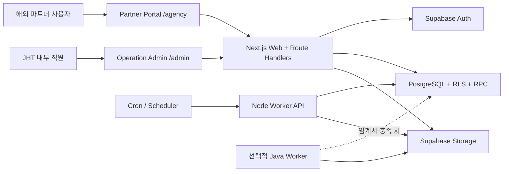
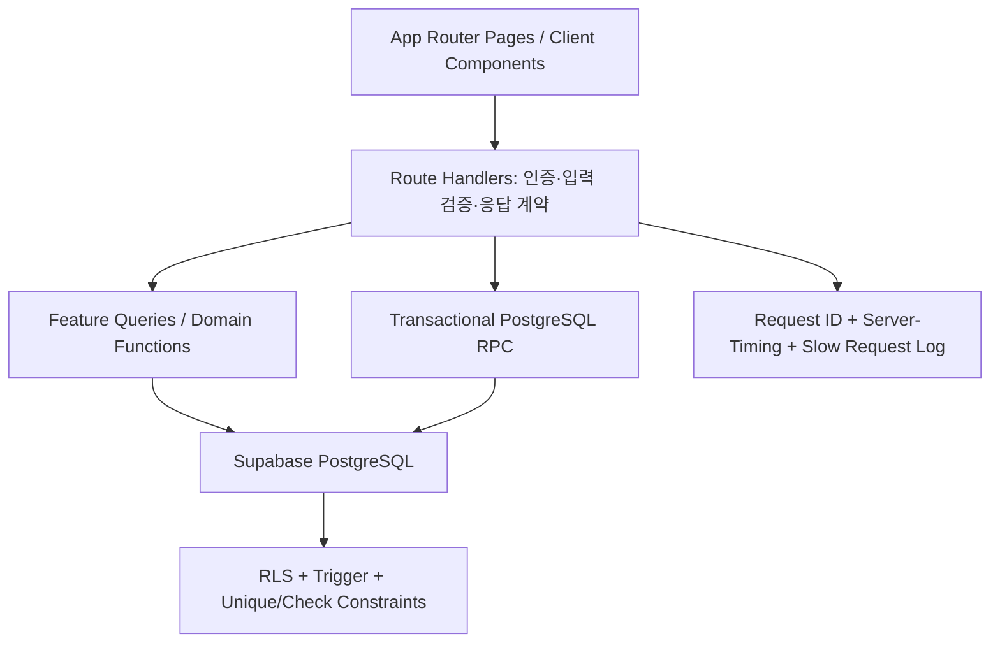
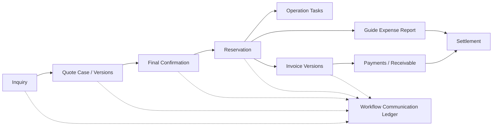

# JHT Booking System 아키텍처

## 1. 목적

정호여행사의 해외 파트너 문의부터 견적, 확정, 예약 운영, 인보이스, 입금, 정산, 가이드 실제 비용까지 하나의 `Workflow Code`로 관리한다. 현재 웹 애플리케이션은 `Next.js + TypeScript`, 인증·데이터·RLS는 Supabase PostgreSQL이 담당한다.

## 2. 시스템 컨텍스트

## 3. 절대 업무 경계

| 영역 | 의미 | 주요 테이블 |
|---|---|---|
| Overseas Agency | 견적을 요청하고 대금을 지급하는 해외 고객사 | `agency_accounts`, `agency_users`, `agency_inquiries` |
| Domestic Supplier | 호텔·차량·식당·관광지·가이드 등 국내 원가 공급자 | `domestic_suppliers`, `supplier_products`, `supplier_prices` |

두 영역은 UI, API, RLS, 외래키에서 분리한다. `partner`라는 공용 테이블로 합치지 않는다. 파트너 포털에는 공급사 원가, 내부 메모, 마진, 운영 태스크를 노출하지 않는다.

## 4. 계층 구조

- 화면은 업무 흐름과 입력 상태를 담당한다.
- Route Handler는 인증, 허용 값, 요청 크기, 공개 응답 경계를 검증한다.
- 계산 규칙은 `src/lib/domain`과 `src/features`에 둔다.
- 여러 테이블을 바꾸는 핵심 작업은 PostgreSQL RPC 한 트랜잭션으로 실행한다.
- RLS와 DB 제약은 API 실수나 우회 접근에도 마지막 방어선으로 작동한다.

## 5. 핵심 데이터 흐름

`new inquiry code = quotation code = confirmation code = reservation workflow code = invoice tour code = finance code = guide report workflow code` 원칙을 유지한다. 문서 버전 번호는 동일 코드 뒤에 `-INV-V02`처럼 붙인다.

## 6. 대규모 조회 설계

- 대량 목록은 `page`, `pageSize` 계약을 사용하며 기본 20, 최대 100행이다.
- 검색·상태 필터는 브라우저가 아니라 PostgreSQL에서 수행한다.
- 응답은 `{ data, pagination }`이며 `pagination`에는 `page`, `pageSize`, `total`, `totalPages`, `hasPrevious`, `hasNext`가 포함된다.
- 예약 대시보드는 목록 일부를 합산하지 않고 `get_reservation_dashboard` RPC가 전체 필터 범위를 집계한다.
- 달력은 선택 월 범위만 조회하고 화면 보호를 위해 한 번에 최대 250개 이벤트를 렌더링한다.
- 주요 검색·정렬 경로에는 복합 인덱스와 `pg_trgm` 인덱스를 둔다.

## 7. 원자성·멱등성

| 작업 | DB 경계 | 보호 방식 |
|---|---|---|
| 파트너 문의 제출 | `submit_agency_inquiry_atomic` | 로그인 agency user 재검증, 문의·스레드·메시지·감사 로그 단일 트랜잭션 |
| Notion CSV staging | `stage_notion_csv_batch_atomic` | 배치·모든 행·감사 로그 단일 트랜잭션 |
| 인보이스 생성 | `create_invoice_version_atomic` | 예약 advisory lock, 버전 직렬화, 라인·workflow·감사 로그 단일 트랜잭션 |
| 메시지 추가 | `append_workflow_message_v2` | 메시지·thread 상태·action item 단일 트랜잭션 |
| 견적 수락 | `sync_accepted_quote_workflow` trigger | accepted quote에서 reservation/history/workflow 원자 생성 |

사용자 버튼 요청에는 `idempotency-key`를 붙인다. 네트워크 오류 후 재시도할 때 같은 키를 유지하며, 성공한 뒤에만 새 키를 만든다.

## 8. 캐시와 관측성

- 권한·예약·견적·재무 응답은 `no-store`가 기본이다.
- 공개 국가 마스터만 `s-maxage=300`, `stale-while-revalidate=86400`으로 캐시한다.
- 계측 대상 API는 `x-request-id`와 `Server-Timing`을 반환한다.
- `API_SLOW_REQUEST_MS` 기본값은 750ms이며 초과 요청만 구조화 경고 로그를 남긴다.
- 운영 환경에서는 호스팅 로그를 APM/로그 수집기로 전달하고 request ID로 DB 로그와 연결한다.

## 9. 비동기 워커와 Java 하이브리드 경계

웹 CRUD는 현재 Node 런타임에 유지한다. XLSX/PDF 생성, 대량 CSV 변환, 대규모 정산 계산처럼 CPU·메모리 또는 장시간 실행이 필요한 작업만 worker 후보이다.

`claim_quote_export_jobs`는 `FOR UPDATE SKIP LOCKED`와 lease를 사용해 여러 Node/Java worker가 작업을 중복 처리하지 않게 한다. `finish_quote_export_job`은 lease 소유자만 완료·실패 상태를 기록하고 감사 로그도 같은 트랜잭션에 남긴다. Java worker는 Supabase REST/RPC 또는 제한된 DB 계정으로 같은 계약을 사용하며 웹 DB 테이블을 직접 임의 수정하지 않는다.

Java 도입 기준과 측정값은 [성능·확장성 운영 가이드](performance-scalability.md)와 [Java 하이브리드 결정 기록](java-hybrid-decision.md)을 따른다.

## 10. 검증 계층

1. `npm test`: 도메인, 보안 경계, 스키마 회귀 테스트
2. `npm run typecheck`: TypeScript 계약
3. `npm run build`: 프로덕션 번들
4. `npm run test:e2e`: 데스크톱/모바일 핵심 흐름과 hydration·overflow 검사
5. `npm run smoke:load`: 동시 요청 p95·오류율 예산
6. `npx supabase db lint --local`: 함수·정책·스키마 SQL 검사
7. `npm run verify:v1`: 출시 전 전체 정적·런타임 점검

## 11. 배포 단위

- Web: Next.js 단일 배포 단위. `/admin`과 `/agency`는 URL·세션 경계로 분리한다.
- Database: 순서가 보장된 `supabase/migrations`만 사용한다.
- Worker: 초기에는 Next automation endpoint, 필요 시 독립 Node/Java 컨테이너로 교체한다.
- Storage: exports, media 등 버킷별 공개 범위와 signed URL 정책을 분리한다.

상세 테이블, 화면, 전체 ERD는 [시스템 블루프린트](system-blueprint.md)를 참고한다.
