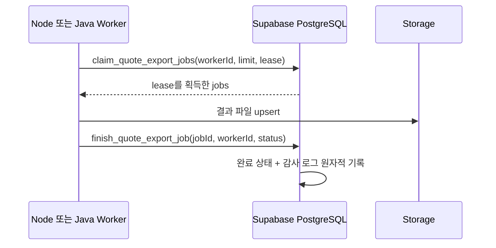

# Java 하이브리드 아키텍처 결정 기록

## 상태

2026-07-15 기준: **웹 CRUD는 Java로 전환하지 않음. 비동기 worker 경계는 Java 호환으로 구현 완료.**

## 판단 근거

- 최종 프로덕션 빌드의 인증 API 부하 테스트 300요청/동시성15에서 오류 0, p95 211.2ms, p99 282.2ms였다.
- 현재 병목 후보는 TypeScript 언어 자체보다 DB 조회 범위, 인덱스, 다단계 쓰기, 브라우저 렌더링이었다.
- Java를 CRUD 중간 계층으로 추가하면 Next -> Java -> Supabase 호출이 생겨 지연, 인증 전달, 배포, 모니터링, 장애 복구가 복잡해진다.
- 팀이 두 런타임을 운영해야 하므로 현재 규모에서는 총비용이 성능 이득보다 크다.

## Java가 적합한 후보

1. 수만 행 이상의 Notion/Excel 정규화와 검증
2. 대형 XLSX/PDF/이미지 일괄 생성
3. 장기간·대규모 정산 재계산
4. 외부 공급사 메시지 대량 발송과 재시도
5. CPU 중심 최적화·리포팅 작업

## 도입 트리거

다음 조건 중 하나가 실제 APM과 부하 테스트에서 반복될 때 ADR을 재검토한다.

- DB 최적화 후에도 worker 작업 p95가 30초 이상
- worker CPU가 15분 이상 70% 초과
- Node event-loop lag p95가 100ms 초과
- queue oldest age가 5분 이상
- 단일 작업 메모리가 512MB를 반복 초과
- Java 프로토타입이 같은 입력에서 처리량 2배 이상 또는 비용 30% 이상 절감

## 구현된 언어 중립 계약

- `FOR UPDATE SKIP LOCKED`로 worker 간 중복 claim을 방지한다.
- lease 만료 작업은 다른 worker가 재수거한다.
- 완료 함수는 lock owner를 확인한다.
- 함수 실행 권한은 `service_role`에만 부여한다.
- worker는 공개 API나 사용자 JWT를 사용하지 않는다.

## Java 도입 시 표준

- Java 25 LTS와 당시 안정화된 Spring Boot 4.x를 기준으로 검토한다.
- 별도 제한 DB 사용자 또는 Supabase service credential을 secret manager에서 주입한다.
- HTTP controller를 먼저 늘리지 않고 queue consumer로 시작한다.
- OpenTelemetry trace ID를 `x-request-id`와 연결한다.
- 동일 job payload로 Node/Java golden test를 통과해야 전환한다.
- canary worker 1개로 시작하고 실패율·처리량·비용을 비교한 뒤 비율을 늘린다.

## 금지 사항

- 성능 측정 없이 “Java가 더 빠르다”는 이유로 CRUD를 재작성하지 않는다.
- Java가 RLS를 우회해 임의 테이블을 갱신하지 않는다.
- Node와 Java가 서로 다른 상태 전이 규칙을 구현하지 않는다.
- lease 없이 queue row를 조회 후 update하는 방식을 사용하지 않는다.
