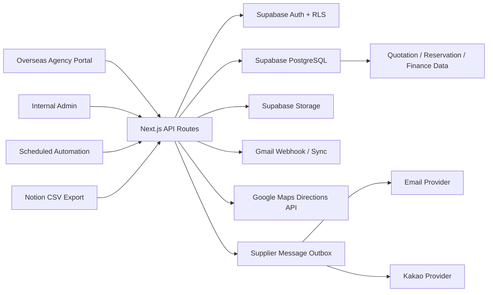
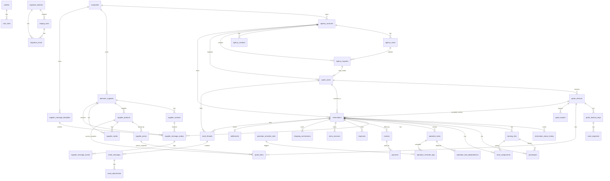
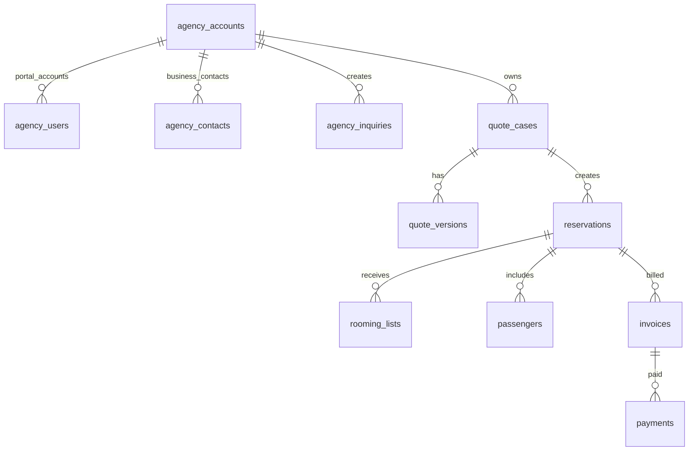
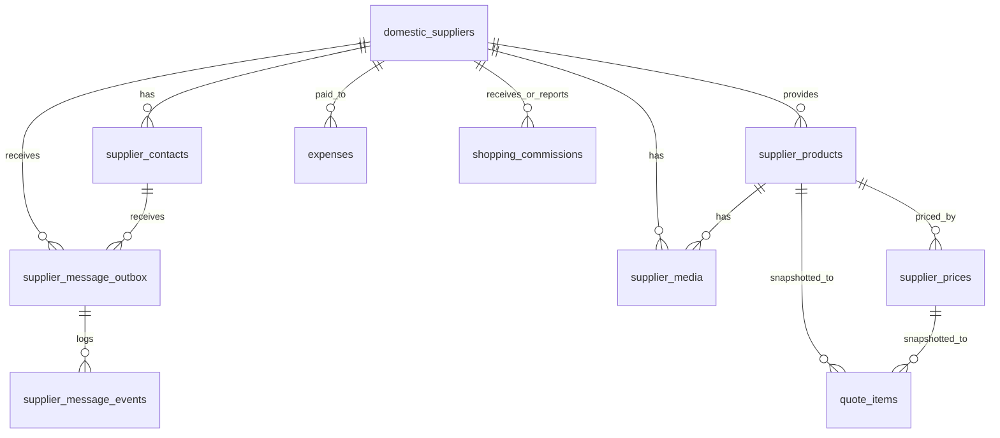
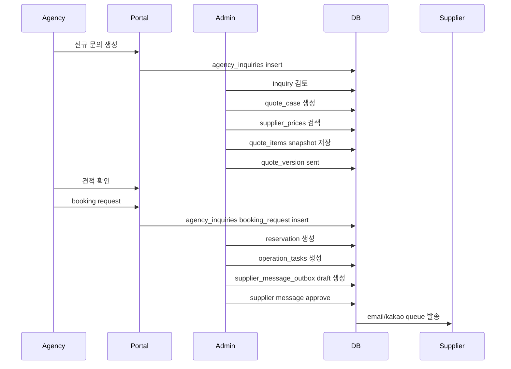
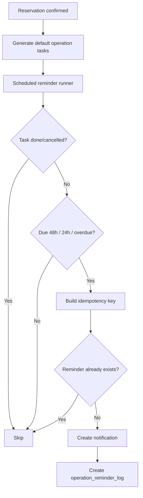
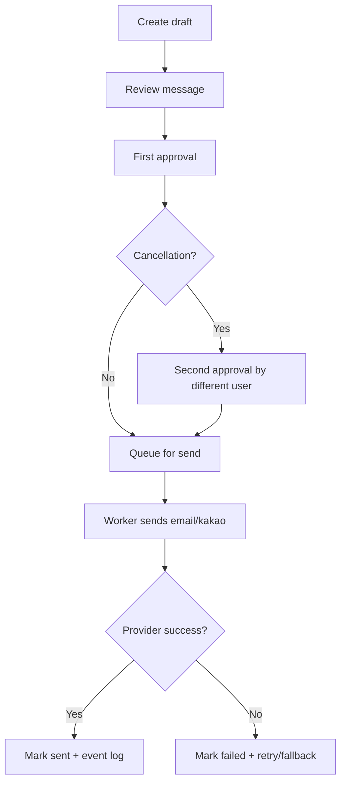
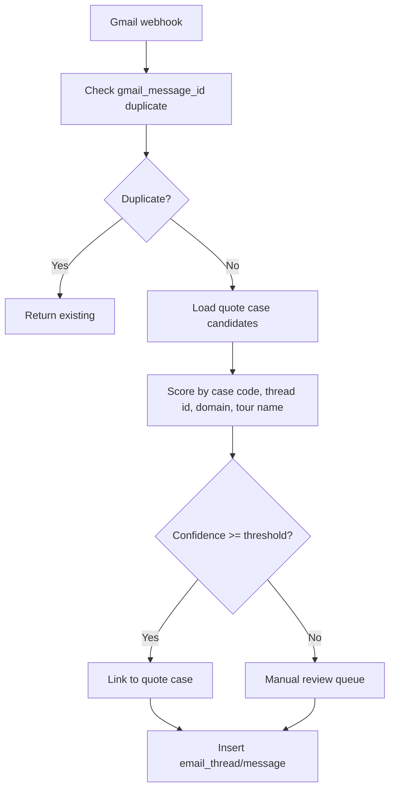

# JHT Operations Platform System Blueprint

## 1. 전체 시스템 정의

### 1.1 시스템 목적

정호여행사의 인바운드 여행 운영 업무를 `Next.js + Supabase` 기반의 내부 운영 시스템과 해외 여행사 고객 포털로 전환한다.

이 시스템의 목적은 단순한 견적서 작성 도구가 아니다. 견적, 예약, 공급사 커뮤니케이션, 오퍼레이션 업무, 룸링리스트, 인보이스, 입금, 지출, 쇼핑수수료, 정산까지 하나의 case 기준으로 추적 가능한 운영 시스템을 만드는 것이다.

핵심 목표:

- 원가 DB를 구축해 호텔, 차량, 식당, 관광지, 가이드, 기타 비용을 검색 가능하게 한다.
- 원가 snapshot 기반으로 견적서를 생성해 과거 견적의 수익 계산이 깨지지 않게 한다.
- 해외 여행사 파트너가 문의, 견적 확인, 수정 요청, 예약 요청, 룸링리스트 업로드, 인보이스 확인을 할 수 있게 한다.
- 내부 팀이 예약 확정 후 팀별 업무를 추적하고 자동 리마인드를 받을 수 있게 한다.
- 국내 공급사에게 예약, 변경, 취소, 확정 메시지를 이메일/카카오로 보낼 수 있게 한다.
- 모든 high-risk action은 승인, 감사로그, idempotency key를 통해 통제한다.
- Notion CSV 데이터를 staging table로 적재하고 검수 후 운영 DB로 승격한다.

### 1.2 시스템 경계

이 시스템은 정호여행사 운영 업무를 우선 범위로 한다. 올마이투어 플랫폼과의 직접 통합은 v1 범위가 아니며, 향후 별도 API 또는 데이터 warehouse를 통해 연결한다.

포함 범위:

- 내부 Admin
- 해외 Agency Portal
- 국내 Supplier communication outbox
- Supabase DB/Auth/Storage/RLS
- Gmail webhook/sync entry point
- Notion CSV staging migration
- Operation reminder automation
- Excel export queue
- Audit/API log

v1 제외 범위:

- 국내 공급사 로그인 포털
- 실시간 객실 inventory hold
- 외부 결제 PG 직접 결제
- 자동 회계 전표 생성
- 완전 자동 Gmail 판단 후 예약 변경
- AI 챗봇의 쓰기 권한

향후 확장 범위:

- 국내 공급사 포털
- Agency용 read-only chatbot
- Kakao provider 실제 발송 worker
- Google Maps Directions 결과 캐싱/요금화
- 회계 시스템 연동
- 쇼핑센터 매출 자동 수집

### 1.3 핵심 비즈니스 용어

| 용어 | 시스템명 | 정의 | 주의사항 |
|---|---|---|---|
| 해외 여행사 파트너 | `Overseas Agency` | 정호여행사에 견적을 문의하고 현지에서 판매/모객하며 투어비를 지불하는 1차 고객 | `agency_*` 테이블만 사용 |
| 한국 현지 공급 파트너 | `Domestic Supplier` | 호텔, 차량, 식당, 관광지, 가이드 등 한국 내 원가/서비스 공급자 | `domestic_suppliers`, `supplier_*` 테이블만 사용 |
| Quote Case | `quote_cases` | 공유 ID가 있는 견적 건 단위 | Agency와 연결됨 |
| Quote Version | `quote_versions` | 견적 버전 | 하나의 case에 여러 version 가능 |
| Quote Item | `quote_items` | 견적 원가/판매가 항목 | 원가 snapshot 필수 |
| Reservation | `reservations` | Agency가 견적을 승인해 생성된 확정 예약 건 | 상태 이력 필수 |
| Operation Task | `operation_tasks` | 팀별 실행 업무 | 리마인드/의존성 추적 |
| Supplier Message | `supplier_message_outbox` | 공급사 예약/변경/취소/확정 발송 대기 건 | 승인 전 발송 금지 |
| Settlement | `settlements` | 행사 종료 후 수익/지출/추가수익 정산 결과 | finance 권한 필요 |

### 1.4 절대 금지 설계 규칙

- `partner`라는 단일 테이블로 해외 Agency와 국내 Supplier를 섞지 않는다.
- `agency_id`와 `domestic_supplier_id`를 같은 의미로 사용하지 않는다.
- Agency Portal에 원가, 마진, 공급사 단가, 내부 정산, 지출 내역을 노출하지 않는다.
- 공급사 취소/변경/확정 메시지는 자동으로 즉시 발송하지 않는다.
- Gmail 자동 매칭 confidence가 낮은 메일을 자동으로 기존 case에 연결하지 않는다.
- 원가 DB가 수정되어도 과거 quote item snapshot을 변경하지 않는다.
- 룸링리스트 재업로드 시 동일 고객/객실을 중복 생성하지 않는다.
- payment, settlement, cancellation, supplier send 같은 high-risk action을 로그 없이 처리하지 않는다.

## 2. 사용자와 권한 모델

### 2.1 사용자 유형

| 사용자 | 설명 | 주요 권한 |
|---|---|---|
| Admin | 시스템 관리자 | 전체 조회/관리, role 관리, high-risk approval |
| Sales | 해외 Agency 문의/견적 담당 | Agency, inquiry, quote case 관리 |
| Operations | 일정/행사 운영 담당 | reservation, itinerary, operation task 관리 |
| Hotel Booking | 호텔 예약 담당 | 호텔 관련 task, supplier message draft |
| Vehicle Booking | 차량 예약 담당 | 차량 관련 task, supplier message draft |
| Guide Assignment | 가이드 배정 담당 | 가이드 task, 연락처 관리 |
| Content Booking | 식당/관광지/콘텐츠 예약 담당 | 식당/관광지 task, supplier message draft |
| Finance | 인보이스/입금/지출/정산 담당 | invoice, payment, expense, settlement 관리 |
| Agency User | 해외 여행사 직원 | 자기 회사 문의/견적/예약/인보이스 조회, 룸링리스트 업로드 |

### 2.2 권한 원칙

내부 사용자는 role 기반으로 권한을 부여한다. Agency 사용자는 `agency_users.auth_user_id`와 `agency_account_id` 기준으로 자기 회사 데이터만 조회한다.

권한 기준:

- 내부 사용자는 `user_roles`에 내부 role이 있어야 한다.
- Agency 사용자는 `agency_users`에 active 상태로 등록되어야 한다.
- Domestic Supplier는 v1에서 로그인하지 않는다.
- Finance 데이터는 `admin` 또는 `finance` role만 쓰기 가능하게 한다.
- Agency는 `quote_versions.agency_visible_summary`와 `public_total_amount` 중심으로 견적을 본다.
- Agency는 `quote_items`, `supplier_prices`, `expenses`, `settlements`를 볼 수 없다.

### 2.3 High-Risk Action

아래 작업은 반드시 승인자, 승인 시간, 변경 전/후 데이터, request id 또는 idempotency key를 남긴다.

| 작업 | 위험 | 필수 통제 |
|---|---|---|
| 예약 확정 | 실제 공급사/고객 일정 확정 | status history, audit log |
| 예약 취소 | 실제 공급 예약 취소 가능 | 2단계 승인 권장 |
| 공급사 변경/취소 메시지 발송 | 중복/오발송 시 예약 사고 | approval, second approval for cancellation, outbox idempotency |
| 인보이스 발행 | 회계/청구 영향 | finance approval, audit log |
| 입금 처리 | 회계 영향 | idempotency key, audit log |
| 정산 승인 | 손익 확정 | finance/admin approval |
| 대량 메일/카카오 발송 | 커뮤니케이션 사고 | dry-run, approval, rate limit |

## 3. 추천 아키텍처

### 3.1 기술 스택

| 영역 | 기술 | 선택 이유 |
|---|---|---|
| Frontend | Next.js App Router | Admin/Agency Portal/API route를 하나의 코드베이스에서 관리 |
| DB/Auth/RLS | Supabase PostgreSQL/Auth | RLS 기반 multi-tenant 데이터 격리 |
| Storage | Supabase Storage | 이미지, 메뉴판, 견적 export, 룸링리스트 파일 저장 |
| Automation | Next API route + scheduled runner | reminder/Gmail/migration/outbox worker 확장 가능 |
| Email | Gmail API / SMTP provider | 문의 수집, 공급사 발송 |
| Kakao | Kakao Alimtalk/Friendtalk provider | 공급사 메시지 발송 |
| Map | Google Maps Directions API | 일정 이동시간/동선 시각화 |
| Export | XLSX worker | 기존 견적서 양식 기반 Excel 생성 |
| Future AI | read-only chatbot + tool layer | Agency 문의 응대/견적 조회 보조 |

### 3.2 상위 구성도



### 3.3 모듈 구조

| 모듈 | 목적 | 주요 테이블 | 주요 UI/API |
|---|---|---|---|
| `agency` | 해외 여행사 회사/사용자/문의 관리 | `agency_accounts`, `agency_users`, `agency_contacts`, `agency_inquiries` | Agency Portal, inquiry API |
| `supplier` | 국내 공급사/상품/가격/미디어 관리 | `domestic_suppliers`, `supplier_contacts`, `supplier_products`, `supplier_prices`, `supplier_media` | Admin supplier/cost DB |
| `costing` | 원가 검색/선택/quote snapshot 생성 | `supplier_products`, `supplier_prices`, `quote_items` | Cost search API |
| `quotation` | 견적 case/version/item/Excel export | `quote_cases`, `quote_versions`, `quote_items`, `quote_itinerary_days`, `route_segments`, `quote_exports` | Quote builder, Agency quote view |
| `reservation` | 확정 예약/상태 이력/룸링리스트 | `reservations`, `reservation_status_history`, `rooming_lists`, `passengers`, `room_assignments` | Reservation dashboard, Agency upload |
| `operations` | 팀별 task/의존성/리마인드 | `operation_tasks`, `operation_task_dependencies`, `operation_reminder_rules`, `operation_reminder_logs` | Operation board, reminder API |
| `supplier_comms` | 공급사 메시지 draft/approval/send queue | `supplier_message_templates`, `supplier_message_outbox`, `supplier_message_events` | Supplier message admin |
| `finance` | 청구/입금/지출/추가수익/정산 | `invoices`, `payments`, `expenses`, `extra_revenues`, `shopping_commissions`, `settlements` | Finance dashboard |
| `automation` | Gmail, reminders, migration, retry queue | `email_threads`, `email_messages`, `migration_batches`, `staging_rows`, `api_logs` | Automation routes |
| `audit` | 감사로그/API 로그 | `audit_logs`, `api_logs` | Admin audit viewer |

## 4. 기능명세서

### 4.1 Internal Admin Dashboard

목적:

- 내부 팀이 견적, 예약, 업무, 공급사 커뮤니케이션, 정산 상태를 한 화면에서 추적한다.

주요 기능:

- 오늘/이번 주 마감 업무 표시
- 신규 Agency 문의 표시
- 견적 작성 중/발송/수정 요청 상태 표시
- 예약 확정 후 팀별 미완료 task 표시
- 승인 대기 supplier message 표시
- 미발행 invoice, 미입금 payment 표시
- Gmail 수동 연결 대기 메일 표시

필터:

- 회사: JHT, AMT
- 팀: sales, operations, hotel, vehicle, guide, content, finance
- 상태: new, quoting, sent, accepted, confirmed, overdue
- 기간: tour start date, due date, created date

검증 규칙:

- 내부 role 없는 사용자는 접근 불가
- finance metric은 finance/admin만 상세 조회
- overdue task는 담당자/팀/예약 기준으로 추적 가능해야 함

### 4.2 Overseas Agency Management

목적:

- 해외 여행사 고객 회사를 관리하고 portal 계정을 발급한다.

주요 기능:

- Agency 회사 등록
- 국가, email domain, billing currency, 웹사이트, 연락처 등록
- Agency user 등록
- sub account 생성
- 견적 수신자, 인보이스 수신자 관리
- Agency별 quote/reservation/invoice 조회

주요 데이터:

- `agency_accounts`
- `agency_users`
- `agency_contacts`
- `agency_inquiries`

권한:

- 내부 admin/sales는 전체 agency 관리 가능
- Agency user는 자기 회사 정보만 조회
- Agency user는 자기 계정 정보 일부만 수정 가능

실패 대응:

- 같은 agency에 같은 email 중복 등록 방지
- email domain 자동 매칭은 보조 정보로만 사용
- agency user 비활성화 시 portal 접근 차단

### 4.3 Domestic Supplier Master Data

목적:

- 한국 국내 공급사와 원가 데이터를 구조화해 견적에서 검색 가능하게 한다.

주요 기능:

- 공급사 등록: 호텔, 차량, 식당, 관광지, 가이드, 쇼핑, 지자체, 관광공사, 기타
- 공급사 담당자 등록: 이메일, 휴대폰, 카카오 수신 가능 여부
- 상품 등록: 객실, 차량 타입, 메뉴, 입장권, 가이드 서비스
- 가격 등록: 시즌, 요일, 인원 조건, 유효기간, 통화, 원가
- 이미지/메뉴판/요금표 업로드
- Naver Map URL legacy 저장
- Google Place ID/좌표 저장

주요 데이터:

- `domestic_suppliers`
- `supplier_contacts`
- `supplier_products`
- `supplier_prices`
- `supplier_media`

검색 조건:

- 키워드
- 공급사 카테고리
- 지역
- 상품 타입
- 유효기간
- 인원 조건
- 통화

검증 규칙:

- `supplier_prices.valid_to >= valid_from`
- 가격은 음수 불가
- `supplier_products.status = active`인 것만 견적 검색 기본 노출
- Agency Portal에서 supplier price 조회 불가

### 4.4 Cost Search and Quote Snapshot

목적:

- 내부 오퍼레이터가 원가 DB에서 항목을 검색하고 견적 항목으로 추가한다.

주요 기능:

- 키워드 기반 원가 검색
- 가격 조건 선택
- 수량, 인원, pricing unit 설정
- 자동 마진율 설정
- 수동 총액 설정
- 수동 마진 금액 설정
- 양수/음수 마진 지원
- quote item snapshot 저장

Snapshot 필드:

- 원본 supplier product id
- 원본 supplier price id
- 상품명
- 공급사명
- 원가 통화
- 원가 금액
- 환율
- 수량
- 인원
- pricing unit
- 마진 방식
- 판매가
- 원가 총액

중요 규칙:

- 견적 저장 후 supplier price가 바뀌어도 기존 quote item은 바뀌면 안 된다.
- snapshot 변경은 새 quote version을 생성해 처리한다.
- Agency에는 public total과 agency visible summary만 노출한다.

### 4.5 Quotation Builder

목적:

- 내부 팀이 일정표, 원가, 마진, 지도 이동시간을 포함한 견적을 생성한다.

주요 기능:

- quote case 생성
- quote version 생성
- tour type 라벨 지정
  - `series_package`
  - `incentive_tour`
  - `private_tour`
  - `mice`
  - `other`
- 일자별 itinerary 작성
- 식사 요약 입력
- 원가 항목 추가
- 마진 자동/수동 설정
- Google Maps route segment 저장
- Agency visible summary 작성
- 견적 발송 상태 변경
- Excel export queue 생성

상태:

| 상태 | 의미 |
|---|---|
| `new` | 문의로 생성된 신규 case |
| `triage` | 내부 검토 중 |
| `quoting` | 견적 작성 중 |
| `sent` | Agency에 발송 |
| `revision_requested` | 수정 요청 |
| `accepted` | Agency 승인 |
| `cancelled` | 취소 |
| `expired` | 유효기간 만료 |

Quote Version 상태:

| 상태 | 의미 |
|---|---|
| `draft` | 내부 작성 중 |
| `review` | 내부 검토 중 |
| `sent` | Agency 공개 |
| `accepted` | 예약 전환 기준 version |
| `superseded` | 새 버전으로 대체됨 |
| `cancelled` | 취소됨 |

검증 규칙:

- quote case는 반드시 `agency_account_id`를 가진다.
- quote item은 원가 snapshot을 가진다.
- Agency에 공개 가능한 version은 `sent`, `accepted`, `superseded`만 허용한다.
- quote item 상세 원가와 마진은 Agency 조회 금지다.

### 4.6 Excel Quote Export

목적:

- 기존 정호여행사 견적서 형태를 유지하면서 DB snapshot 기반 Excel 파일을 생성한다.

주요 기능:

- quote version 기준 export 요청
- `quote_exports`에 queue 생성
- worker가 XLSX 생성
- Supabase Storage에 저장
- export status 업데이트

Export 원칙:

- Excel cell 참조 기반 계산에 의존하지 않는다.
- DB snapshot으로 계산된 값을 Excel에 출력한다.
- Agency용 견적서에는 원가/마진 내부 컬럼을 숨긴다.
- 내부용 원가표 export는 별도 권한으로 제공한다.

### 4.7 Agency Portal

목적:

- 해외 Agency가 자기 회사의 문의, 견적, 예약, 룸링리스트, 인보이스 상태를 확인한다.

주요 기능:

- 신규 문의 생성
- 기존 상품 문의 생성
- 견적 상세 조회
- 견적 수정 요청
- 예약 요청
- 룸링리스트/고객 명단 업로드
- 인보이스 조회
- 입금 상태 확인

Agency가 볼 수 있는 데이터:

- 자기 회사 `agency_inquiries`
- 자기 회사 `quote_cases`
- 공개 상태의 `quote_versions`
- 공개 일정표와 route summary
- 자기 회사 `reservations`
- 자기 reservation의 rooming list/passenger data
- 자기 reservation의 invoices/payments summary

Agency가 볼 수 없는 데이터:

- `supplier_prices`
- `quote_items`
- `expenses`
- `shopping_commissions`
- `settlements`
- `operation_tasks`
- `supplier_message_outbox`

검증 규칙:

- Agency user는 `agency_users.auth_user_id`로 식별한다.
- 다른 agency의 quote share id를 알아도 RLS로 조회 불가해야 한다.
- 룸링리스트 업로드는 `reservation_id + revision_no` 또는 idempotency key로 중복 방지한다.

### 4.8 Reservation Lifecycle

목적:

- Agency가 견적을 승인하면 예약 건을 생성하고 이후 변경/확정/취소/행사완료까지 상태를 추적한다.

예약 상태:

| 상태 | 의미 |
|---|---|
| `pending` | 예약 요청 접수 |
| `requested` | 공급사 예약 요청 중 |
| `confirmed` | 공급사/내부 확정 |
| `on_tour` | 행사 진행 중 |
| `completed` | 행사 완료 |
| `cancelled` | 취소 |

주요 기능:

- accepted quote version 기준 reservation 생성
- reservation code 생성
- status history 저장
- 변경/취소 reason 저장
- 확정 시 operation task 자동 생성
- 관련 supplier message draft 생성

검증 규칙:

- status 변경은 `reservation_status_history`에 반드시 저장한다.
- 취소는 취소 사유와 승인자를 저장한다.
- 동일 quote case에서 중복 reservation 생성 방지 정책이 필요하다.
- reservation 생성 후 quote snapshot은 보존한다.

### 4.9 Rooming List and Passenger Management

목적:

- Agency가 전달하는 고객 명단과 객실 배정 정보를 업로드하고 reservation 기준으로 관리한다.

주요 기능:

- Excel/CSV 룸링리스트 업로드
- passenger parsing
- room assignment parsing
- revision 관리
- 중복 passenger 방지
- passport/dietary/coach label 등 메타데이터 저장

주요 데이터:

- `rooming_lists`
- `passengers`
- `room_assignments`

검증 규칙:

- 같은 reservation에서 `passenger_no` 중복 금지
- 같은 reservation에서 revision 중복 금지
- 재업로드는 새 revision으로 저장
- 기존 passenger 변경은 이력 관리가 필요하다.
- PII 데이터는 Agency 자기 reservation만 조회 가능해야 한다.

### 4.10 Operation Task and Reminder

목적:

- 예약 확정 후 부서별 업무를 자동 생성하고 마감 전/초과 시 자동 리마인드한다.

기본 팀:

- Sales
- Operations
- Hotel Booking
- Vehicle Booking
- Guide Assignment
- Content Booking
- Finance

기본 task:

| 팀 | Task | 기본 마감 |
|---|---|---|
| Sales | Agency final request check | 행사 30일 전 |
| Operations | Finalize itinerary | 행사 21일 전 |
| Hotel Booking | Confirm hotel room block | 행사 21일 전 |
| Vehicle Booking | Confirm coach and vehicle assignment | 행사 14일 전 |
| Guide Assignment | Assign guide and share contact | 행사 10일 전 |
| Content Booking | Confirm meals, attractions, content bookings | 행사 10일 전 |
| Finance | Issue invoice and check deposit | 행사 7일 전 |

Reminder rule:

| Rule | 조건 | 알림 대상 |
|---|---|---|
| `due_48h` | 마감 48시간 이내 | 담당자 |
| `due_24h` | 마감 24시간 이내 | 담당자 + 팀 리드 |
| `overdue` | 마감 초과 | 담당자 + 팀 리드 + 관리자 |

중복 방지:

`reservation_id + task_id + rule_id + reminder_date`

검증 규칙:

- 완료/취소 task는 reminder 대상에서 제외한다.
- 선행 task 미완료 시 blocking 담당자에게 알림을 보낸다.
- 동일 날짜 같은 reminder는 한 번만 생성한다.
- reminder 실패 시 retry 대상에 남긴다.

### 4.11 Supplier Communication

목적:

- 국내 공급사에게 예약, 변경, 취소, 확정, 행사 전 리마인드 메시지를 안전하게 발송한다.

메시지 타입:

- `booking_request`
- `confirmation_request`
- `change_request`
- `cancellation_request`
- `final_confirmation`
- `pre_event_reminder`

채널:

- `email`
- `kakao_alimtalk`
- `kakao_friendtalk`

흐름:

1. reservation 기준으로 공급사별 message draft 생성
2. 내부 담당자 내용 검토
3. 승인 처리
4. cancellation은 2차 승인
5. send 요청 시 outbox status를 `queued`로 변경
6. worker가 provider 발송
7. provider 응답을 event log에 저장
8. 실패 시 retry 또는 fallback email 처리

상태:

| 상태 | 의미 |
|---|---|
| `draft` | 작성 중 |
| `pending_approval` | 승인 요청 |
| `approved` | 승인 완료 |
| `queued` | 발송 대기 |
| `sending` | provider 처리 중 |
| `sent` | 발송 완료 |
| `failed` | 실패 |
| `cancelled` | 발송 취소 |

검증 규칙:

- approved/queued/sending/sent 상태는 `approved_by`, `approved_at` 필수다.
- cancellation queued/sending/sent는 `second_approved_by` 필수다.
- idempotency key로 중복 발송을 막는다.
- Kakao 실패 시 email fallback draft 또는 queue를 생성한다.
- 모든 provider 응답은 `supplier_message_events`에 저장한다.

### 4.12 Finance and Settlement

목적:

- 견적/예약 기준으로 청구, 입금, 지출, 추가수익, 쇼핑수수료, 최종 손익을 관리한다.

주요 기능:

- invoice 생성/발행
- payment 등록/확인
- 국내 공급사 지출 등록
- 옵션 상품/추가 수익 등록
- 사후면세점 쇼핑수수료 등록
- settlement 계산
- settlement 승인/마감

주요 데이터:

- `invoices`
- `payments`
- `expenses`
- `extra_revenues`
- `shopping_commissions`
- `settlements`

검증 규칙:

- payment는 idempotency key를 지원한다.
- expense는 reservation과 supplier를 연결할 수 있어야 한다.
- settlement 승인 시 승인자/승인시간 필수다.
- Agency에는 invoice/payment summary만 노출한다.
- expense, shopping commission, settlement 상세는 Agency 노출 금지다.

### 4.13 Gmail Integration

목적:

- 신규 문의, 기존 상품 문의, 변경/취소 요청 메일을 수집하고 기존 quote/reservation case와 연결한다.

매칭 기준:

- case code
- Gmail thread id
- agency email domain
- tour name
- subject/body keyword

흐름:

1. Gmail webhook 수신
2. Gmail message id 중복 확인
3. quote case 후보 조회
4. confidence score 계산
5. score가 기준 이상이면 자동 연결
6. score가 낮으면 manual review queue로 이동
7. message, thread, attachment 저장

검증 규칙:

- `gmail_message_id`는 unique다.
- confidence score와 reasons를 저장한다.
- 낮은 confidence는 자동 연결하지 않는다.
- 수동 연결 후 audit log를 남긴다.

### 4.14 Notion CSV Migration

목적:

- 기존 Notion 데이터를 CSV로 export한 뒤 운영 DB에 바로 넣지 않고 staging table에서 검수한다.

흐름:

1. CSV upload
2. `migration_batches` 생성
3. row별 `staging_rows` 저장
4. mapping rule 적용
5. validation
6. error row는 `migration_errors` 저장
7. human approval
8. 운영 table로 import
9. import 결과 audit log 저장

지원 대상:

- `agency_accounts`
- `agency_contacts`
- `domestic_suppliers`
- `supplier_contacts`
- `supplier_products`
- `supplier_prices`

검증 규칙:

- 운영 DB import 전 human approval 필수
- target table allowlist 외 import 금지
- supplier price는 product mapping 완료 후 import
- agency와 supplier를 같은 mapping으로 처리하지 않는다.

### 4.15 Future Partner Chatbot

목적:

- 해외 Agency가 견적/예약/인보이스 상태를 자연어로 조회할 수 있게 한다.

v1 이후 원칙:

- read-only부터 시작한다.
- quote/reservation/invoice 조회만 허용한다.
- 원가/마진/공급사 가격/정산은 tool 권한에서 제외한다.
- 예약 확정, 취소, supplier 발송, payment 처리 같은 high-risk action은 직접 실행하지 않는다.
- 챗봇 답변에는 참조한 case id, quote version, reservation code를 표시한다.

Agent 구성:

- Planner agent: 질문 의도 분류
- Retriever/tool layer: 권한 확인 후 데이터 조회
- Reviewer agent: 노출 금지 정보 포함 여부 검토
- Response layer: Agency용 응답 생성
- Logging layer: 질문/조회/응답 기록

## 5. ERD

### 5.1 전체 핵심 ERD



### 5.2 Agency Boundary ERD



Agency RLS 기준:

- `agency_users.auth_user_id = auth.uid()`
- `agency_users.agency_account_id = target.agency_account_id`
- Agency는 자기 `agency_account_id`와 연결된 row만 조회 가능
- Agency insert는 inquiry, rooming list, passenger upload 중심으로 제한

### 5.3 Domestic Supplier Boundary ERD



Domestic Supplier RLS 기준:

- v1에서 supplier login 없음
- 모든 supplier master/cost/message table은 internal role만 접근
- Agency Portal 접근 금지

## 6. 데이터베이스 상세 설계

### 6.1 Company and User

`companies`

| 필드 | 목적 |
|---|---|
| `code` | JHT, AMT 등 회사 구분 |
| `name_ko`, `name_en` | 표시명 |
| `status` | active/inactive/archived |

`profiles`

| 필드 | 목적 |
|---|---|
| `id` | Supabase auth user id |
| `email` | 로그인 이메일 |
| `display_name` | 내부 표시명 |
| `default_company_id` | 기본 회사 |

`user_roles`

| 필드 | 목적 |
|---|---|
| `user_id` | profile id |
| `role` | admin/sales/operations/finance/agency_user 등 |
| `team` | operation team |

### 6.2 Agency Tables

`agency_accounts`

- 해외 여행사 회사 단위
- billing currency, email domain, website 보관
- 모든 quote/reservation/invoice의 customer-side owner

`agency_users`

- Agency Portal 계정
- `auth_user_id`와 연결
- sub account 지원
- agency별 email unique

`agency_contacts`

- quote 수신자, invoice 수신자, 영업 담당자 등
- 로그인 계정이 아닌 연락처도 관리 가능

`agency_inquiries`

- 신규 문의, 수정 요청, 예약 요청, 변경/취소 요청
- `related_quote_case_id`로 기존 quote case 연결 가능
- 자유 형식 요청은 `request_payload`에 저장

### 6.3 Domestic Supplier Tables

`domestic_suppliers`

- 한국 국내 공급사 회사/기관/개인 단위
- category: hotel, vehicle, restaurant, attraction, guide 등
- Google/Naver map reference 저장

`supplier_contacts`

- 공급사 담당자
- email/phone/kakao 가능 여부
- 예약 메시지 수신 여부

`supplier_products`

- 객실, 차량, 메뉴, 입장권, 가이드 서비스 등
- 검색명, 설명, capacity, room type, menu tags

`supplier_prices`

- 상품별 원가
- pricing unit, currency, cost amount
- season, weekday, valid period, pax 조건

`supplier_media`

- 이미지, 메뉴판, 요금표, 첨부파일
- supplier 또는 product 둘 중 하나에 연결

### 6.4 Quote Tables

`quote_cases`

- 견적 건
- `agency_account_id` 필수
- `share_id`로 Agency Portal 공유 조회
- `case_code`로 Gmail/문서/내부 식별

`quote_versions`

- 견적 버전
- public total과 internal total 분리
- Agency에는 `agency_visible_summary`, `public_total_amount` 중심 노출

`quote_items`

- 견적 항목 snapshot
- source supplier product/price는 reference일 뿐이며 계산 기준은 snapshot
- Agency RLS select 금지

`quote_itinerary_days`

- 일자별 일정
- public description과 internal notes 분리

`route_segments`

- Google Maps 이동 구간
- 이동시간, 거리, provider payload 저장
- Agency에는 sent/accepted version의 공개 route만 조회 허용

`quote_exports`

- XLSX 생성 queue
- storage path와 status 관리

### 6.5 Reservation Tables

`reservations`

- 확정 예약
- quote case와 accepted quote version에 연결
- agency account 필수

`reservation_status_history`

- 상태 변경 이력
- 변경 전/후 상태, 사유, 변경자 저장

`rooming_lists`

- 업로드된 룸링리스트 revision
- storage path, idempotency key 저장

`passengers`

- 고객 명단
- 같은 reservation 내 passenger no unique

`room_assignments`

- 객실 배정
- passenger ids 배열 저장

### 6.6 Operations Tables

`operation_tasks`

- 팀별 업무
- reservation 기준 생성
- supplier 관련 task는 `domestic_supplier_id` 연결 가능

`operation_task_dependencies`

- 선후행 업무 관계

`operation_reminder_rules`

- 마감 전/초과 리마인드 rule

`operation_reminder_logs`

- 리마인드 발송 이력
- idempotency key unique

### 6.7 Supplier Communication Tables

`supplier_message_templates`

- 메시지 템플릿
- category, message type, channel, locale 기준

`supplier_message_outbox`

- 발송 대기/승인/완료 상태
- reservation, domestic supplier, contact 연결
- approval/second approval/idempotency 관리

`supplier_message_events`

- provider 응답, retry, fallback 이벤트 저장

### 6.8 Finance Tables

`invoices`

- reservation 기준 청구서
- invoice no unique
- status, due date, storage path

`payments`

- invoice 기준 입금
- idempotency key 지원

`expenses`

- reservation 지출
- domestic supplier 연결 가능

`extra_revenues`

- 옵션 상품 등 추가 수익

`shopping_commissions`

- 사후면세점 쇼핑수수료

`settlements`

- reservation별 최종 손익
- approved 상태에는 승인자/승인시간 필수

### 6.9 Automation and Audit Tables

`email_threads`

- Gmail thread와 quote/reservation 연결
- confidence score와 manual review flag

`email_messages`

- Gmail message 저장
- gmail message id unique

`email_attachments`

- 첨부파일 storage reference

`migration_batches`, `staging_rows`, `migration_errors`

- Notion CSV staging/import 검수 흐름

`audit_logs`

- high-risk action 이력

`api_logs`

- 외부 API/webhook/automation 처리 이력

## 7. API 설계

### 7.1 Agency API

| Method | Endpoint | 목적 | 권한 |
|---|---|---|---|
| `GET` | `/api/agency/inquiries` | 자기 회사 문의 목록 | Agency user |
| `POST` | `/api/agency/inquiries` | 신규/기존 상품 문의 생성 | Agency user |
| `GET` | `/api/agency/quote-cases/:shareId` | 공유 견적 조회 | Agency user + RLS |
| `POST` | `/api/agency/quote-cases/:id/revision-request` | 견적 수정 요청 | Agency user |
| `POST` | `/api/agency/quote-cases/:id/booking-request` | 예약 요청 | Agency user |
| `POST` | `/api/agency/rooming-lists/upload` | 룸링리스트 업로드 | Agency user |

### 7.2 Internal API

| Method | Endpoint | 목적 | 권한 |
|---|---|---|---|
| `GET` | `/api/cost-items/search` | 원가 검색 | Internal |
| `POST` | `/api/quote-cases` | 견적 case/version 생성 | Internal |
| `POST` | `/api/quote-versions/:id/export-xlsx` | XLSX export queue 생성 | Internal |
| `POST` | `/api/reservations/:id/generate-operation-tasks` | 예약 기준 task 생성 | Internal |
| `PATCH` | `/api/operation-tasks/:id` | task 상태/담당자 수정 | Internal |
| `POST` | `/api/operation-tasks/:id/remind` | 수동 리마인드 | Internal |
| `POST` | `/api/supplier-messages/draft` | 공급사 메시지 draft 생성 | Internal |
| `POST` | `/api/supplier-messages/:id/approve` | 공급사 메시지 승인 | Internal |
| `POST` | `/api/supplier-messages/:id/send` | 발송 queue 등록 | Internal |
| `POST` | `/api/migrations/notion-csv` | Notion CSV staging | Internal |

### 7.3 Automation API

| Method | Endpoint | 목적 | 인증 |
|---|---|---|---|
| `POST` | `/api/automation/reminders/run` | reminder rule 실행 | `x-automation-secret` |
| `POST` | `/api/gmail/webhook` | Gmail message 수신 | `x-webhook-secret` |

### 7.4 API 공통 규칙

- 모든 API는 JSON 응답을 반환한다.
- 인증 실패는 401, 권한 실패는 403을 반환한다.
- high-risk API는 audit log를 남긴다.
- 외부 webhook/automation API는 shared secret을 요구한다.
- 중복 생성 위험이 있는 작업은 idempotency key를 사용한다.
- server-side에서만 service role key를 사용한다.

## 8. 주요 워크플로우

### 8.1 신규 견적 문의부터 예약 확정까지



### 8.2 Operation Reminder



### 8.3 Supplier Message Approval



### 8.4 Gmail Matching



## 9. 화면 설계

### 9.1 Internal Admin Routes

권장 route:

```text
/admin
/admin/agencies
/admin/agencies/[agencyId]
/admin/domestic-suppliers
/admin/domestic-suppliers/[supplierId]
/admin/costing/search
/admin/quote-cases
/admin/quote-cases/[quoteCaseId]
/admin/quote-cases/[quoteCaseId]/versions/[versionId]
/admin/reservations
/admin/reservations/[reservationId]
/admin/operations/tasks
/admin/supplier-messages
/admin/finance/invoices
/admin/finance/settlements
/admin/automation/gmail-review
/admin/migrations/notion-csv
/admin/audit
```

### 9.2 Agency Portal Routes

권장 route:

```text
/agency
/agency/inquiries
/agency/inquiries/new
/agency/quote-cases/[shareId]
/agency/reservations
/agency/reservations/[reservationId]
/agency/reservations/[reservationId]/rooming-lists
/agency/invoices
```

### 9.3 화면별 핵심 UI

| 화면 | 핵심 UI |
|---|---|
| Admin dashboard | overdue task, quote status, supplier approval queue, finance alerts |
| Cost search | keyword search, category filter, region filter, price validity, add to quote |
| Quote builder | itinerary by day, cost item table, margin controls, route map, public summary |
| Reservation detail | status timeline, task board, supplier message list, rooming list, finance summary |
| Supplier message detail | template preview, recipient, channel, approval buttons, event logs |
| Finance settlement | invoice/payment/expense/revenue/commission/profit summary |
| Gmail review | message preview, suggested case, confidence score, manual link |
| Migration staging | uploaded rows, mapping, validation errors, approve import |
| Agency quote view | public itinerary, route summary, total amount, revision/booking request |
| Agency rooming upload | file upload, parsed passenger preview, revision list |

## 10. 디렉터리 구조

### 10.1 현재 구현 구조

```text
.
├── docs
│   ├── api-contract.md
│   ├── architecture.md
│   ├── claude-code-prompt-set.md
│   └── system-blueprint.md
├── src
│   ├── app
│   │   ├── admin
│   │   │   └── page.tsx
│   │   ├── agency
│   │   │   └── page.tsx
│   │   ├── api
│   │   │   ├── agency
│   │   │   ├── automation
│   │   │   ├── cost-items
│   │   │   ├── gmail
│   │   │   ├── migrations
│   │   │   ├── operation-tasks
│   │   │   ├── quote-cases
│   │   │   ├── quote-versions
│   │   │   ├── reservations
│   │   │   └── supplier-messages
│   │   ├── globals.css
│   │   ├── layout.tsx
│   │   └── page.tsx
│   └── lib
│       ├── api
│       │   ├── audit.ts
│       │   ├── auth.ts
│       │   ├── guards.ts
│       │   └── http.ts
│       ├── domain
│       │   ├── gmail-match.mjs
│       │   ├── ids.ts
│       │   ├── operations.mjs
│       │   ├── quotation.mjs
│       │   ├── supplier-messages.mjs
│       │   └── terminology.ts
│       └── supabase
│           └── server.ts
├── supabase
│   ├── config.toml
│   ├── migrations
│   │   └── 202605100001_initial_schema.sql
│   └── seed.sql
├── tests
│   ├── domain.test.mjs
│   └── schema-boundary.test.mjs
├── package.json
├── next.config.mjs
└── tsconfig.json
```

### 10.2 권장 확장 구조

실제 개발이 진행되면 아래처럼 route, component, service, repository를 분리한다.

```text
src
├── app
│   ├── admin
│   │   ├── agencies
│   │   ├── domestic-suppliers
│   │   ├── costing
│   │   ├── quote-cases
│   │   ├── reservations
│   │   ├── operations
│   │   ├── supplier-messages
│   │   ├── finance
│   │   ├── automation
│   │   └── audit
│   ├── agency
│   │   ├── inquiries
│   │   ├── quote-cases
│   │   ├── reservations
│   │   └── invoices
│   └── api
├── components
│   ├── common
│   ├── admin
│   ├── agency
│   ├── costing
│   ├── quotation
│   ├── reservation
│   ├── operations
│   ├── supplier-comms
│   └── finance
├── features
│   ├── agency
│   │   ├── actions.ts
│   │   ├── queries.ts
│   │   ├── schemas.ts
│   │   └── types.ts
│   ├── supplier
│   ├── costing
│   ├── quotation
│   ├── reservation
│   ├── operations
│   ├── supplier-comms
│   ├── finance
│   ├── automation
│   └── audit
├── lib
│   ├── api
│   ├── auth
│   ├── domain
│   ├── supabase
│   ├── storage
│   ├── integrations
│   │   ├── gmail
│   │   ├── google-maps
│   │   ├── kakao
│   │   └── email
│   └── workers
│       ├── excel-export
│       ├── supplier-outbox
│       ├── reminders
│       └── gmail-sync
└── styles
```

구조 원칙:

- `app`은 route/page/API entry point에 집중한다.
- `features`는 업무 기능별 query/action/schema/type을 가진다.
- `components`는 UI 컴포넌트만 가진다.
- `lib/domain`은 DB 없이 테스트 가능한 순수 비즈니스 로직을 가진다.
- `lib/integrations`는 외부 API adapter를 가진다.
- `lib/workers`는 queue 처리 로직을 가진다.

## 11. 보안 설계

### 11.1 환경변수

필수:

```text
NEXT_PUBLIC_SUPABASE_URL
NEXT_PUBLIC_SUPABASE_ANON_KEY
SUPABASE_SERVICE_ROLE_KEY
AUTOMATION_SECRET
GMAIL_WEBHOOK_SECRET
GOOGLE_MAPS_API_KEY
GMAIL_CLIENT_ID
GMAIL_CLIENT_SECRET
GMAIL_REFRESH_TOKEN
KAKAO_API_KEY
EMAIL_PROVIDER_API_KEY
```

원칙:

- service role key는 server-side에서만 사용한다.
- client bundle에 secret이 포함되면 안 된다.
- webhook secret은 rotation 가능해야 한다.
- provider token은 DB에 plain text로 저장하지 않는다.

### 11.2 RLS 원칙

- 모든 business table은 RLS enable 상태여야 한다.
- internal user는 `has_internal_role()`로 판별한다.
- finance write는 `has_finance_role()`로 제한한다.
- agency access는 `is_agency_member(agency_account_id)`로 판별한다.
- supplier/cost/finance internal table에는 agency select policy를 만들지 않는다.

### 11.3 PII 보호

PII 대상:

- passenger full name
- passport no
- date of birth
- dietary requirements
- phone/email
- rooming list file

보호:

- Agency는 자기 reservation PII만 조회 가능
- 내부 admin도 audit log 기반으로 조회 추적 권장
- export 파일은 storage path 접근 정책 필요
- 로그에는 passport no 등 민감정보를 남기지 않는다.

## 12. 실패 지점과 복구 계획

| 실패 지점 | 영향 | 예방 | 복구 |
|---|---|---|---|
| Agency/Supplier 혼용 | 권한/회계 오류 | 테이블 분리, 테스트 | 데이터 migration script로 분리 |
| 공급사 메시지 중복 발송 | 예약 사고 | idempotency key, outbox | event log 기준 provider 확인 후 수동 정정 |
| Gmail 오매칭 | 잘못된 case 변경 | confidence score, manual review | email_thread 재연결 audit |
| 원가 변경이 과거 견적 반영 | 손익 오류 | quote snapshot | 새 quote version 발행 |
| 룸링리스트 중복 업로드 | 고객/객실 오류 | revision/idempotency/passenger unique | duplicate review UI |
| Kakao 장애 | 공급사 알림 누락 | fallback email, retry queue | failed outbox 재처리 |
| Excel export 실패 | 견적 발송 지연 | queue status/error 저장 | 재시도 버튼 |
| reminder 중복 | 업무 피로/혼선 | reminder idempotency | log 기준 중복 제거 |
| settlement 오입력 | 손익 왜곡 | approval/audit | settlement reopen 권한 |

## 13. 테스트 전략

### 13.1 Unit Test

대상:

- quote margin calculation
- quote snapshot generation
- reminder idempotency key
- supplier message approval rule
- Gmail matching score
- route/date/status helper

### 13.2 Database Test

대상:

- agency/supplier table 분리
- RLS agency isolation
- supplier price agency 접근 차단
- quote item agency 접근 차단
- finance agency 접근 차단
- status history insert
- supplier message check constraint

### 13.3 API Test

대상:

- Agency inquiry 생성
- Agency quote 조회 권한
- cost item search internal only
- quote case 생성
- operation task 생성 idempotency
- supplier message draft/approve/send
- Gmail duplicate message 방지
- migration staging allowlist

### 13.4 Frontend Test

대상:

- Admin dashboard 상태 표시
- Quote builder item 추가/삭제/마진 계산
- Agency quote view 원가 미노출
- Rooming upload preview
- Supplier message approval button state
- Finance settlement 계산

### 13.5 E2E Test

시나리오:

1. Agency user가 문의 생성
2. 내부 sales가 quote case 생성
3. 원가 검색 후 quote item 추가
4. quote version sent 처리
5. Agency가 견적 조회 후 booking request
6. 내부 reservation 생성
7. operation task 생성
8. supplier message draft 생성
9. 승인 후 queued
10. invoice 생성
11. payment 등록
12. settlement draft 생성

## 14. 구현 단계

### Phase 1: Foundation

목표:

- Next.js + Supabase 기본 구조
- Auth/RLS/role/audit
- agency/supplier DB 경계 고정

완료 기준:

- build/typecheck/test 통과
- agency와 supplier 테이블 분리
- RLS 기본 정책 존재
- 문서화 완료

### Phase 2: Master Data

목표:

- Domestic Supplier/Cost DB 관리 UI
- Notion CSV staging
- media upload

주요 작업:

- supplier list/detail/create/edit
- product/price CRUD
- media storage
- CSV mapping UI

### Phase 3: Quotation

목표:

- quote builder
- margin calculation
- itinerary/route
- Excel export

주요 작업:

- cost search UI
- quote case/version/item CRUD
- public/internal view 분리
- export worker

### Phase 4: Agency Portal

목표:

- Agency inquiry/quote/reservation/invoice self-service

주요 작업:

- inquiry form
- quote viewer
- revision/booking request
- rooming list upload
- invoice/payment summary

### Phase 5: Reservation and Operations

목표:

- reservation lifecycle
- operation task automation
- reminder notification

주요 작업:

- reservation create/status change
- status history UI
- task board
- reminder runner

### Phase 6: Supplier Communications

목표:

- supplier message template/outbox/provider event

주요 작업:

- template CRUD
- draft generation
- approval flow
- send queue worker
- email/kakao provider adapter

### Phase 7: Finance and Automation

목표:

- invoice/payment/expense/revenue/settlement
- Gmail sync
- future chatbot read model

주요 작업:

- finance dashboard
- settlement calculation
- Gmail manual review
- chatbot read-only API boundary

## 15. Claude Code 작업 규칙

각 개발 단계에서 Claude Code에 줄 작업은 반드시 작게 나눈다.

공통 지시:

- 먼저 현재 파일 구조를 inspect한다.
- 변경 전 계획을 설명한다.
- 관련 없는 refactor를 하지 않는다.
- 변경 파일 목록을 마지막에 출력한다.
- test command를 실행한다.
- DB schema 변경 시 migration 파일을 새로 만든다.
- Agency와 Domestic Supplier를 절대 generic partner로 합치지 않는다.

작업 단위 예시:

```text
Phase 2-1: domestic supplier list/detail UI only
Phase 2-2: supplier product CRUD only
Phase 2-3: supplier price CRUD only
Phase 2-4: Notion CSV staging upload only
Phase 3-1: cost search UI only
Phase 3-2: quote case create only
Phase 3-3: quote item snapshot and margin only
```

## 16. 다음 액션

가장 먼저 진행할 실질 개발 작업:

1. Supabase local DB에 migration 적용
2. seed data 확인
3. Admin Domestic Supplier CRUD 구현
4. Supplier Product/Price CRUD 구현
5. Cost Search UI 구현
6. Quote Builder v1 구현

권장 첫 Claude Code prompt:

```text
Inspect the current Next.js + Supabase project.
Implement Phase 2-1 only: Internal Admin Domestic Supplier list and detail pages.
Use existing schema names exactly: domestic_suppliers, supplier_contacts, supplier_products, supplier_prices.
Do not introduce a generic partner model.
Do not implement Agency Portal changes in this phase.
Add server-side auth check for internal users.
Add empty/loading/error states.
List changed files and run npm.cmd run typecheck and npm.cmd run build.
```
