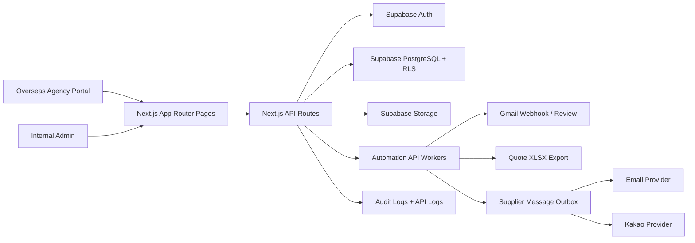
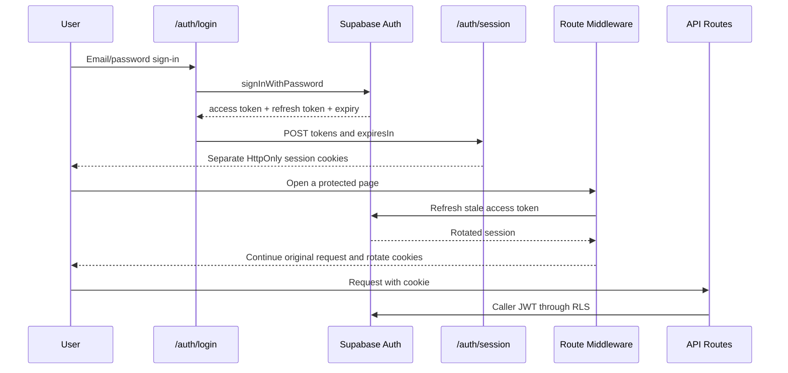
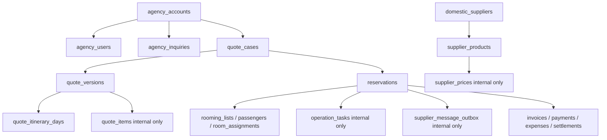
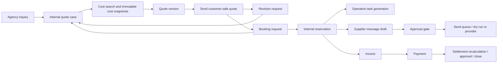

# JHT Booking System V1 System Design

Last reviewed: 2026-06-27

## Purpose

JHT Booking System V1 is an inbound travel operations platform for Jungho Travel. It supports internal operation teams and overseas agency customers from inquiry intake through quotation, booking, operations, supplier communication, invoice, payment, settlement, automation, and audit.

The most important design rule is the hard separation between:

| Business side | System term | Main tables | Visibility |
|---|---|---|---|
| Foreign customer travel company | Overseas Agency | `agency_accounts`, `agency_users`, `agency_inquiries` | Can see only its own inquiry, quote, reservation, rooming list, invoice, and safe payment summary |
| Korea-side service vendor | Domestic Supplier | `domestic_suppliers`, `supplier_contacts`, `supplier_products`, `supplier_prices` | Internal-only in V1 |

Do not introduce a generic partner model. Agency and supplier data have different permissions, accounting flows, communication flows, and UI surfaces.

## Runtime Architecture

## Application Surfaces

### Internal Admin

Internal admin is role-based and operational. It includes:

- Dashboard and V1 readiness.
- Company and internal user administration.
- Overseas Agency account, contact, and portal user management.
- Domestic Supplier master data, products, contacts, and price inputs.
- Cost search and quote case management.
- Excel-style quote rows with service section, calculation mode, cell reference, formula note, manual override, and cost/public breakdown metadata.
- Reservation lifecycle, rooming lists, room assignments, and operation tasks.
- Supplier message drafting, approval, sending, provider callback, retry, and event history.
- Finance invoices, payments, expenses, extra revenues, shopping commissions, settlements, and settlement locks.
- Gmail manual review, Notion CSV migration staging, failed automation jobs, audit logs, and sanitized API logs.

### Overseas Agency Portal

Agency Portal is customer-safe and scoped by active `agency_users` membership:

- Inquiry list and new inquiry form.
- Quote list and quote detail with public itinerary, route summary, status, and public total.
- Revision request and booking request actions.
- Reservation list and detail.
- Rooming list upload and parsed passenger view for the agency's own reservation.
- Invoice list and printable invoice detail.

The portal must not expose supplier cost, quote item internals, margins, operation tasks, supplier outbox rows, expenses, commissions, settlements, internal payment references, or passport numbers.

## Authentication And Session Model

Session and response rules:

- `/auth/session` accepts same-origin requests only.
- The access token and refresh token are stored separately in `jht_access_token` and `jht_refresh_token` as HttpOnly, SameSite=Lax cookies with path `/`.
- Cookie `Max-Age` follows the Supabase session expiry with server-side min/max clamps.
- The refresh cookie remains available for up to 30 days so middleware can rotate a stale access token without interrupting active work.
- Safe `next` routing returns users to the protected page they originally selected and blocks cross-portal or external redirects.
- HTTPS deployments use the Secure cookie flag, including proxy deployments with `x-forwarded-proto: https`.
- `POST /auth/logout` clears both cookies and returns no-store headers. The top bar submits a form instead of prefetching a state-changing GET link.
- JSON API responses use shared response helpers and enforce `Cache-Control: no-store`.
- Server errors are returned as a generic `Internal server error` message to avoid leaking SQL, RLS, provider, or environment details.

## Data And Permission Model

RLS and application guards work together:

- Agency APIs require an authenticated active agency user and rely on RLS for tenant isolation.
- Internal APIs require an internal role.
- Finance APIs require `admin` or `finance`.
- Admin bootstrap requires `x-bootstrap-secret`.
- Automation APIs require `x-automation-secret`.
- Provider/webhook APIs require matching webhook secrets.
- `/api/health` is the only public API route.

## Core Workflow

## Automation Design

| Automation | Trigger | Guard | Output | Safety point |
|---|---|---|---|---|
| Operation reminders | Scheduled or manual API call | `x-automation-secret` or internal user | Reminder logs | Stable idempotency keys, terminal task skip |
| Quote XLSX export | Internal export request then worker | `x-automation-secret` | XLSX file in Storage and export status | Uses DB snapshot values, failed jobs can retry |
| Supplier message delivery | Approved queued outbox then worker | `x-automation-secret` | Provider events and outbox status | Draft-first, approval-gated, dry-run default |
| Supplier provider callback | Provider webhook | `x-webhook-secret` and provider secret | Event log and status update | Match by idempotency/provider ID |
| Gmail webhook | Gmail push/event | `x-webhook-secret` | Email thread/message and match candidates | Duplicate Gmail ID rejection, manual review for low confidence |
| Notion CSV migration | Internal upload and status gate | Internal user | Staging rows, validation errors, import | Import only approved validated rows |

## Verification Gates

Run `npm run verify:v1` before handoff or deployment. It includes:

- Environment readiness alignment.
- Schema, seed, RLS, and policy coverage checks.
- API guard, request body order, response helper, and contract checks.
- Repository safety and security config checks.
- Launch runbook, page smoke, and app route smoke coverage.
- Unit/domain tests.
- TypeScript typecheck.
- Production build.
- Production runtime smoke.

Current expected runtime smoke surface:

- 37 App Router pages.
- 78 API handlers.
- 3 app route smoke checks.
- 4 baseline security header checks.

## Deployment Handoff Boundaries

Before connecting a real Supabase project or custom domain:

1. Do not load local demo users into production.
2. Apply migrations to the real Supabase project.
3. Create required Storage buckets.
4. Configure production environment variables and rotate bootstrap/automation/webhook secrets.
5. Configure Auth redirect URLs for the production domain.
6. Keep supplier message delivery in dry-run until provider credentials and approval workflow are confirmed.
7. Confirm Agency Portal boundary with a real agency test user.
8. Run `npm run verify:v1` again after environment wiring.
